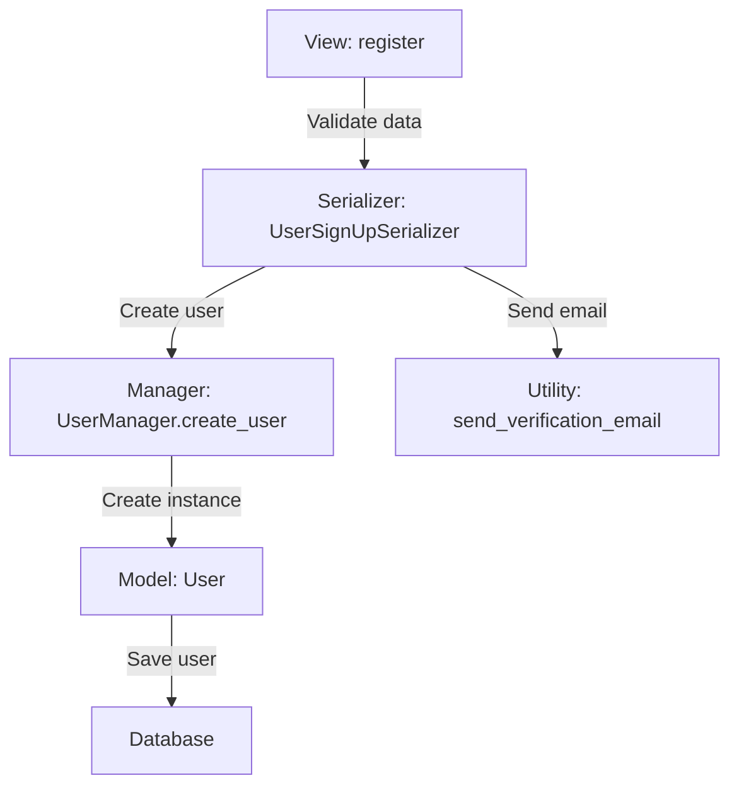

# Django_Rest_Framework

## Django Rest Framework (DRF) Implementation Approaches

DRF can be implemented in various ways depending on your project's requirements. Below is a breakdown of the most common approaches, their use cases, and a decision tree to help you choose the best approach.


## Table of DRF Implementation Approaches

| Approach | Description | When to Use |
|---|---|---|
| API-Only (No Templates) | DRF is used solely for building RESTful APIs. No Django templates are used. | When the frontend is completely separate (e.g., React, Angular, Vue.js). |
| API + Templates (Admin/Simple UI) | DRF provides APIs, and Django templates are used for admin or simple UIs. | When you need a simple frontend or admin interface alongside APIs. |
| Hybrid Approach (API + Templates) | DRF provides APIs, and Django templates are used for rendering the frontend. | When you want a monolithic app with server-rendered templates and APIs. |
| API + Templates for Forms | DRF handles APIs, and Django templates are used for form rendering/handling. | When you need to render and process forms using Django templates. |
| API + Templates for SSR | DRF provides APIs, and Django templates are used for server-side rendering. | When you need to render dynamic HTML pages on the server. |
| API + Templates for Auth | DRF handles APIs, and Django templates are used for auth pages (login, etc.). | When you need to use Django's built-in auth system alongside APIs. |
| API + Templates for Docs | DRF provides APIs, and Django templates are used for custom API documentation. | When you need to create custom API documentation pages. |
| API + Templates for Testing | DRF provides APIs, and Django templates are used for testing/debugging. | During development for testing and debugging purposes. |


## **Decision Tree for Choosing an Approach**

1. **Is your frontend completely separate (e.g., React, Angular, Vue.js)?**

- **Yes** → Use **API-Only (No Templates)**.

- **No** → Proceed to the next question.

- **Do you need server-rendered HTML pages?**

- **Yes** → Proceed to the next question.

- **No** → Use **API-Only (No Templates)**.

- **Do you need to render forms using Django templates?**

- **Yes** → Use **API + Templates for Forms**.

- **No** → Proceed to the next question.

- **Do you need to render dynamic HTML pages on the server?**

- **Yes** → Use **API + Templates for SSR**.

- **No** → Proceed to the next question.

- **Do you need to use Django's built-in authentication system?**

- **Yes** → Use **API + Templates for Auth**.

- **No** → Proceed to the next question.

- **Do you need custom API documentation pages?**

- **Yes** → Use **API + Templates for Docs**.

- **No** → Proceed to the next question.

- **Do you need testing/debugging pages during development?**

- **Yes** → Use **API + Templates for Testing**.

- **No** → Use **Hybrid Approach (API + Templates)**.

**Let’s consolidate all the concepts and approaches you’ve mentioned into a comprehensive guide that covers:**

1. **Dynamic Actions in a Single View**.

2. **Separate Views for Each Action**.

3. **Hybrid Approach (Combining Templates and APIs)**.

4. **Advanced Renderer Usage in DRF**.

5. **Redirection and HTML Rendering in DRF**.

This guide will provide a clear understanding of how to implement these approaches in Django Rest Framework (DRF) and when to use each one.

| Approach                         | Description                                                                                   | When to Use                                                                 |
|----------------------------------|-----------------------------------------------------------------------------------------------|-----------------------------------------------------------------------------|
| Dynamic Actions in a Single View | Handle multiple actions in one view using a parameter (e.g., action).                         | Small applications with simple forms and limited actions.                  |
| Separate Views for Each Action   | Create separate views for each action (e.g., register, signin, logout).                       | Medium to large applications with complex logic for each action.           |
| Hybrid Approach                  | Combine Django templates for server-side rendering with DRF APIs.                            | Monolithic applications with tightly coupled backend and frontend.         |
| Advanced Renderer Usage          | Customize response formats using DRF renderers (e.g., JSON, HTML, plain text).               | When you need to support multiple response formats.                        |
| Redirection and HTML Rendering   | Use redirect and TemplateHTMLRenderer to navigate and render HTML pages.                     | When you need to redirect users and render HTML templates.                 |

---


## **6. Combining All Approaches**

You can combine the above approaches to build a flexible and powerful application. For example:

- Use **separate views** for each action.

- Use **templates** for server-side rendering.

- Use **APIs** for dynamic functionality.

- Use **renderers** to support multiple response formats.

- Use **redirection** to navigate between pages.

### **Example Workflow**

1. **User visits the home page** (`/`):

- Render an HTML template using `TemplateHTMLRenderer`.

- **User submits a form**:

- Handle the form submission in a DRF view.

- Use `redirect` to navigate to another page.

- **User requests data in JSON format**:

- Use `JSONRenderer` to return a JSON response.

- **User requests data in plain text format**:

- Use a custom `PlainTextRenderer` to return a plain text response.


## **Summary of Approaches**

| Approach | Description | When to Use |
|---|---|---|
| Dynamic Actions in a Single View | Handle multiple actions in one view using a parameter (e.g., action). | Small applications with simple forms and limited actions. |
| Separate Views for Each Action | Create separate views for each action (e.g., register, signin, logout). | Medium to large applications with complex logic for each action. |
| Hybrid Approach | Combine Django templates for server-side rendering with DRF APIs. | Monolithic applications with tightly coupled backend and frontend. |
| Advanced Renderer Usage | Customize response formats using DRF renderers (e.g., JSON, HTML, plain text). | When you need to support multiple response formats. |
| Redirection and HTML Rendering | Use redirect and TemplateHTMLRenderer to navigate and render HTML pages. | When you need to redirect users and render HTML templates. |


## **Decision Tree for Choosing an Approach**

1. **Is your frontend completely separate (e.g., React, Angular, Vue.js)?**

- **Yes** → Use **API-Only (No Templates)**.

- **No** → Proceed to the next question.

- **Do you need server-rendered HTML pages?**

- **Yes** → Proceed to the next question.

- **No** → Use **API-Only (No Templates)**.

- **Do you need to handle multiple actions in one view?**

- **Yes** → Use **Dynamic Actions in a Single View**.

- **No** → Use **Separate Views for Each Action**.

- **Do you need to support multiple response formats (e.g., JSON, HTML)?**

- **Yes** → Use **Advanced Renderer Usage**.

- **No** → Use **Hybrid Approach**.

- **Do you need to redirect users and render HTML templates?**

- **Yes** → Use **Redirection and HTML Rendering**.

- **No** → Use **Hybrid Approach**.

  ## Django Component Interactions(models,serializers,views,utility functions,customs and built-in functionalities)
This document outlines how Django components—models, managers, serializers, views, and utility functions—can interact with each other. This includes use cases, integration patterns, and flow diagrams.

### Tabular Summary

| **Component**        | **Interacts With** | **How**                                                                                                             | **Example**                                                                                                     |
|-----------------------|--------------------|---------------------------------------------------------------------------------------------------------------------|-----------------------------------------------------------------------------------------------------------------|
| **Model**            | Manager            | Uses the custom manager for object creation, retrieval, and querying.                                              | `User.objects.create_user(email, password)`                                                                    |
| **Model**            | Serializer         | Serializer maps data to/from the model fields.                                                                     | Serializer `Meta` class specifies the model and fields.                                                        |
| **Model**            | Views              | Passed to views for CRUD operations.                                                                                | `user = User.objects.get(pk=1)`                                                                                |
| **Model**            | Utility Functions  | Utility functions operate on model instances for business logic.                                                   | `send_verification_email(user)`                                                                                |
| **Manager**          | Model              | Acts as a helper for the model, providing custom query methods.                                                     | `class UserManager(BaseUserManager)`                                                                           |
| **Manager**          | Serializer         | Provides object creation or querying methods used in serializers.                                                   | `User.objects.create_user(...)`                                                                                |
| **Manager**          | Views              | Used directly in views for object creation or querying.                                                             | `User.objects.filter(is_active=True)`                                                                          |
| **Manager**          | Utility Functions  | Utility functions call manager methods to interact with the database.                                               | `active_users = User.objects.get_active_users()`                                                               |
| **Serializer**       | Model              | Maps validated data to create or update model instances.                                                            | `serializer.save()` calls `create` or `update` methods to manipulate model instances.                          |
| **Serializer**       | Views              | Handles input validation and outputs serialized data for API responses.                                             | `serializer = UserSerializer(data=request.data)`                                                               |
| **Serializer**       | Manager            | Uses manager methods for custom object creation logic.                                                              | `User.objects.create_user(...)` inside the `create` method of a serializer.                                     |
| **Serializer**       | Utility Functions  | Utility functions can be called in the `create` or `update` methods for additional logic.                           | `send_verification_email(user)` inside a serializer’s `create` method.                                         |
| **View**             | Serializer         | Uses serializers to handle input and output data for HTTP requests.                                                 | `serializer = UserSerializer(data=request.data)`                                                               |
| **View**             | Model              | Directly queries or updates model instances.                                                                        | `user = User.objects.get(email=email)`                                                                         |
| **View**             | Manager            | Calls manager methods to fetch or manipulate data.                                                                  | `User.objects.filter(is_active=True)`                                                                          |
| **View**             | Utility Functions  | Calls utility functions for actions like sending emails or business logic.                                          | `send_verification_email(user)`                                                                                |
| **Utility Functions**| Model              | Accepts model instances as arguments for operations like email notifications.                                       | `send_verification_email(user)`                                                                                |
| **Utility Functions**| Serializer         | Can be invoked inside serializers during `create` or `update` for additional operations.                           | `send_verification_email(user)` inside `serializer.save()`                                                     |
| **Utility Functions**| Views              | Called in views to handle non-HTTP specific logic, such as sending verification emails or background tasks.          | `if send_verification_email(user):`                                                                            |
| **Utility Functions**| Manager            | Can utilize manager methods for fetching or manipulating data during operations.                                    | `users = User.objects.get_active_users()`                                                                      |

---

### Flow Diagram
#### General Interaction Flow Between Components
1. **Views**:
   - Accept HTTP requests.
   - Use serializers for input validation and output formatting.
   - Call manager methods or utility functions for business logic.
   - Return HTTP responses.

2. **Serializers**:
   - Validate incoming data.
   - Use manager methods for custom object creation or updates.
   - Optionally call utility functions for additional operations.

3. **Managers**:
   - Provide custom query methods and handle complex data-fetching logic.
   - Used by models, serializers, and utility functions.

4. **Models**:
   - Define the database schema and structure.
   - Interact with managers for object manipulation.
   - Passed as arguments to utility functions.

5. **Utility Functions**:
   - Contain reusable logic like sending emails or performing calculations.
   - Accept models, serializers, or raw data as input.

#### Flow Example: User Registration


---

### Key Takeaways
- **Encapsulation**: Each component has a defined responsibility, making the code modular and maintainable.
- **Reusability**: Utility functions, managers, and serializers can be reused across multiple views.
- **Separation of Concerns**: Logic for input validation, object creation, querying, and response formatting is separated across serializers, managers, and views.
- **Flexibility**: The interaction between components is highly customizable, allowing easy extension of functionality.


**Deserialization**

For this flow

Extract data from request body

As it is in stream mean in bytes so parse it in python data through JSON parser and then this python data pass to the serializer and after validation will be saved and then simple show the message of data created successfully

Here serializer working for both serialization (which get the model instance and the pass to the serializer and the convert to json through JSON renderer and then send to the front end and its mostly for just data reading)and ***deserialization involve create, update delete actions***

**Field level validation** 
```python
def validate_fieldname(self):
    # Condition
```

### Object level mean validation on multiple fields

```Def validate(self,data):

name=data.get("name")
```

### Validators

These are used when we have to do the most repeated validation

Def functionname():
Condition
name=serializer.charfield(others_params,validators[functionname])

### Modelform/model serializer

These are similar mean we don't need to create the fields but automatically creates and validators applies on them,nd automatically do for creates, update

As we were creating firstly class by using serializer.serializer but now we will create by using serializer.modelserializer

Now just use the meta class and write the fields name which you are required ,if we want to validate a specific field then just write above the meta class as

Name=serializer.charfield(params,validators[functionname]) also here in this field you can make it read only =true

And if for multiple fields you want to read only then just write under the meta class

Similar validation for one field using function under the meta class

Similar for object level validation

Validators on specific field if repeatedly need the validation using validators inside the field

**View** mostly we say to functions, but **APIview** is for classes which provides the requests methods as per request is hit i.e. get,post and all other methods and we have to define all these methods in this sub Apiview class and then this class will serve the methods as per request is hit,and it has a lot of methods i.e. query_set and other so see documentation for this

**Mixin**it provides all the common behavior like CRUD operations on table its provides the functionalities so just use them,mean we don't need to write the queryset codes ,validate and save this is automatically handled by these classes GenericApiview and modelmixin as we have to write again and again the code of CRUD in views but by using these classes we don't need further more

Also these classes use request methods along with returning the methods respect to the applied mixin,we can shorten the code further as by keeping in the same class i.e. the classes which don't need pk will be in the one class which will inherit the genericapiview,createmodelmixin,listmodelmixin and return the rlevant methods and those group which requires pk will be in the same class other group

**Difference between Apiview**as these provides the requests methods, **genericapiview classes** provides the automatically handled the repeated pattern queryset operations of CRUD on model instance, along with the mixins, while **concreteApiView provides** the same behavior as genericapiview classes but these provides the more customization separately like for Creation,updation deletion etc for these provides the built-in classes like listapiview,createapiview and others etc.Also they provide the classes that handled the combination like for Creation and listening it provides createlistapiview, updateretriveapiview etc

Mean concrete Apiview extends both genericapiview and mixinmodelview and no need both of them anymore when we have the concrete Apiview as it uses the concepts of both of these

**Apiview and viewset** the difference is that viewset provides the action like create,list, CRUD etc instead of methods in Apiview post,get etc, and we can create the CRUD logic at once in the viewset class which will handle automatically CRUD operations on table instances ,router is used for such things which handle the CRUD operations under the sme route including pk etc . The advantage of this class is that repeated set of view logic can be handled under the sme class , router mean no need to define separate URL for those repeated set of view logic

**Modelviewset** is the similar to the above viewset but it's handle the CRUD operations on the instance automatically no need to write the viewset methods separately as above in the viewset and it overrides the methods of apigenericview and uses the concepts of mixin behind the scene

**Authentications:**

**2-Session authentication**

**3-token authentication**

**4-custom authentication**

**5-jwt authentication**

**Authentications:**

**1-Basic authentication**(it uses HTTP authentication which uses user's username and password for authentication, it's mostly do for the testing purposes but for production then use this over https and re-request user's username and password.

**These permission classes are isauthenticated,allowany,isadmin, Djangomodelpermissiononly, isauthenticatedreadonly,djandomodelpermissionorannotatedonly**

If view are class based then these classes i.e. authentication and permission will be used inside the class but for the function base view these classes will be as decorators above the function ,this authentication and permission was to the specific class or function but what if we have to apply globally authentication and permission to all the classes or functions then add these authentication and permission inside the setting.py file, but what if we don't want to apply the authentication and permission to some class as we have set globally authentication and permission so to do this simple write inside the class or function and it will overwrite the global authentication and permission,also we can set the multiple authentication and permission in the square bracket when we write them there in the function or class

)

**2-Session authentication**(uses Django default session backend for authentication  ,mean the session currently in which user is using the website is authnticated then session provides these things request.user which is the Django instance and request.auth None,if we use ajax session authentication then make sure to use the secure csrf token methods like post,patch,update etc,also for Djangomodelpermissions we have to explicitly assign the permission from admin panel to perform the CRUD operations.

)

**Custom Permission** we have to override the base permission by using either or both of the methods i.e. **has_permission,has_permision_object()**,these methods will be defined the inside the class which will inherit the base permission and now use this inside the api class along the authentication, also there are third parties permission in drf which provides the permission 

**3-token authentication**

**4-custom authentication** (to apply this inherit from base authentication class and override the authenticate method which return tuple as i.e.(user,auth) and then use this custom inside the API class inside the authentication in bracket 

**5-jwt authentication**

**Token authentication**:it is token base http authentication ,its best option when there is desktop and mobile app and to use it configure it in installed app and then make sure migrate as it provides db migrations,if authentication is successful the it provides request.user which is Django instance and request.auth which is token.auth instance ,to use it in production then use https,also to create token for this use Django admin, python manage.py command i.e.

Python manage.py drf_create_toke <username>,by using signal and exposing end points

**Relationship in serializer**, when we make serializer from **model.serializer,there is also another hyperlinkedmodelserializer which is similar to modelserializer** which have relationship with each other on the relatedname param so then this relatedname param will be used also in serializer to access the relationship fields, but this param will return id but what if we want the value then simply in serializer class before meta crete the field and inside it many=True and readonly=True and then use this field inside the feilds to access it

Similar we also create the field related to **primarykey,hyperlinked,slugfield, hyperlinkedidentity fields etc**

Also we can do nested serializer mean when we have to show all the details of other serializer in this one ,so simply write down that serializer and and add this in the fields as a field

**: Filter**

In drf we can override the get_query method to get the results on the filter base ,for current user we can use the request.user this return the current user ,we can also use the Djangofilterbackend for highly customizably filtering ,to use it frst install and set in installed app in setting file for further read the documenation of this,for globally set it in rest_framewrok and to use for per view using genericapiview

SearchFilter it supports single query parameter base search ,to ise it include search_field in in your view ,

OrderingFilter for ordering the results

**Pagination** 

Globally in setting file set it in rest_framework and which class you have to use write it from below described 3 classes

For per view, you can set the pagination class on per view along with the page size mean to show number of records per page

**1-pagenumberpagination**,we can override it by inheritting it as a subclass and then use that in the view, paginationqury_params mean the pagination means pages numbering,if we want to decide the page size by client then we can do page_size_query_params

**2-limitoffpagination**

**3-cursor pagination**

**Throttling** mean to limit the rate of api hitting 

And we can set it in globally in setting file for both annotated user and authorizeduser

3 classes used for per view

As annonthrotleclass,userthrotleclass,scopedthrotleclass,we can customize the these classes for per view use

### Summary of the above topics

#### Deserialization
We use deserialization when performing actions like:
- Create
- Update
- Delete

**Flow:**
1. Extract data from the request body.
2. Since it is in a stream (bytes), parse it into Python data through a JSON parser.
3. Pass this Python data to the serializer.
4. After validation, save it and display a success message: "Data created successfully."

Here, the serializer works for both:
- **Serialization:** Takes the model instance, passes it to the serializer, converts it to JSON through a JSON renderer, and sends it to the front end (mostly for data reading).
- **Deserialization:** Involves actions like create, update, and delete.

#### Field-Level Validation
```python
def validate_fieldname(self):
    # Condition
```

#### Object-Level Validation
Validation on multiple fields:
```python
def validate(self, data):
    name = data.get("name")
```

#### Validators
Used for the most repeated validation:
```python
def functionname():
    # Condition

name = serializer.CharField(others_params, validators=[functionname])
```

#### ModelForm / ModelSerializer
- These are similar as we don't need to create fields manually; they are automatically created, and validators are applied.
- Automatically handles create and update actions.
- Previously, we created classes using `serializer.Serializer`. Now, use `serializer.ModelSerializer`.
- Use the `Meta` class to define the required fields.

**Example:**
```python
name = serializer.CharField(params, validators=[functionname])  # Field-level validation

class Meta:
    fields = ['field1', 'field2']
    read_only_fields = ['field3', 'field4']
```

For multiple read-only fields, define them under the `Meta` class.

#### Views
- Functions are referred to as views.
- `APIView` is for classes, providing request methods (e.g., GET, POST).
- Define these methods in the subclass of `APIView`.
- Offers methods like `queryset` and others. Refer to the documentation for more.

#### Mixins
- Provide common behavior (CRUD operations on tables).
- Automatically handle operations like `queryset`, `validate`, and `save`.
- Use classes like `GenericAPIView` and `ModelMixin` to avoid repetitive CRUD code in views.

**Usage:**
- Classes without `pk` can inherit `GenericAPIView`, `CreateModelMixin`, and `ListModelMixin`.
- Classes with `pk` can group related methods.

#### Differences
1. **`APIView`**: Provides request methods.
2. **`GenericAPIView`**: Automatically handles repetitive CRUD operations.
3. **`ConcreteAPIView`**: Extends `GenericAPIView` and `ModelMixin`, offering separate built-in classes (e.g., `ListAPIView`, `CreateAPIView`).
4. **`ViewSet`**: Provides actions like create, list, CRUD, etc., instead of methods (e.g., GET, POST).
5. **`ModelViewSet`**: Similar to `ViewSet`, but automatically handles CRUD operations without defining methods.

#### Authentication
1. **Basic Authentication**: Uses HTTP authentication (username/password). Mostly for testing. Use HTTPS in production.
   ```python
   # Example permission classes:
   IsAuthenticated, AllowAny, IsAdmin, DjangoModelPermission
   ```
2. **Session Authentication**: Uses Django's session backend.
3. **Token Authentication**: Token-based HTTP authentication.
   ```bash
   python manage.py drf_create_token <username>
   ```
4. **Custom Authentication**: Inherit `BaseAuthentication` and override the `authenticate` method.
5. **JWT Authentication**: JSON Web Token-based authentication.

#### Permissions
- Specific to classes or functions using decorators or inside the class.
- For global authentication and permissions, add them in `settings.py`.

#### Custom Permissions
Override `BasePermission`:
```python
class CustomPermission(BasePermission):
    def has_permission(self, request, view):
        # Logic
```

#### Relationships in Serializer
- Use `HyperlinkedModelSerializer` for relationships.
- To display values instead of IDs, define the field with `many=True` and `read_only=True`.
- Nested serializers can show details of other serializers.

#### Filters
- Override `get_queryset` for filtered results.
- Use `DjangoFilterBackend` for customizable filtering.

#### Search Filter
Supports single query parameter-based search:
```python
search_fields = ['field1', 'field2']
```

#### Ordering Filter
Define ordering in views.

#### Pagination
Set globally in `settings.py` or per view.
1. **PageNumberPagination**
2. **LimitOffsetPagination**
3. **CursorPagination**

#### Throttling
Limits API request rates. Define globally or per view:
- `AnonThrottle` for anonymous users.
- `UserThrottle` for authenticated users.
- `ScopedThrottle` for specific scopes.

**Customization:**
Customize throttle classes for specific views.

## Overview of Generic Views in Django

The generic views supplied by Django abstract away a lot of the boilerplate that comes with a view. The Django developers have identified some common patterns of displaying/interacting with data and basically given us a shortcut.

**ListView**
The ListView will get you list of all objects defined by a model. This is great for a high-level view of a collection of items.

**DetailView**
The DetailView is great for looking at a single item. The Django docs show it being used with a slug — I’m using it with my object’s primary key.

**CreateView**
This view is used for making a new item and persisting it to the database. It will infer fields from your model and can supply a form with the appropriate input types.

**UpdateView**
UpdateView is similar to the CreateView, except that it pre-populates the form with the values found in the database.

**DeleteView**
This will delete the record from the database.

```
from django.views import generic
from django.urls import reverse_lazy

from .models import Server


class ServerIndexView(generic.ListView):
    model = Server


class ServerDetailView(generic.DetailView):
    model = Server


class ServerCreateView(generic.edit.CreateView):
    model = Server
    fields = '__all__'


class ServerEditView(generic.edit.UpdateView):
    model = Server
    fields = '__all__'


class ServerDeleteView(generic.edit.DeleteView):
    model = Server
    success_url = reverse_lazy('inventory:server_index')
```
## DRF Views:
### 1. APIView
In DRF, APIView provides methods for handling HTTP requests like GET, POST, PUT, and DELETE.

```python
# DRF APIView Example
from rest_framework.views import APIView
from rest_framework.response import Response
from .models import Item
from .serializers import ItemSerializer

class ItemListView(APIView):
    def get(self, request):
        items = Item.objects.all()
        serializer = ItemSerializer(items, many=True)
        return Response(serializer.data)
```
### 2. GenericAPIView
GenericAPIView provides built-in mixins for common CRUD operations.
```python
# DRF GenericAPIView Example
from rest_framework.generics import GenericAPIView
from rest_framework.mixins import ListModelMixin
from .models import Item
from .serializers import ItemSerializer

class ItemListView(GenericAPIView, ListModelMixin):
    queryset = Item.objects.all()
    serializer_class = ItemSerializer

    def get(self, request, *args, **kwargs):
        return self.list(request, *args, **kwargs)
```
### 3. ConcreteAPIView
ConcreteAPIView automatically handles common CRUD actions like ListAPIView, CreateAPIView, etc.
```python
# DRF ListAPIView Example
from rest_framework.generics import ListAPIView
from .models import Item
from .serializers import ItemSerializer

class ItemListView(ListAPIView):
    queryset = Item.objects.all()
    serializer_class = ItemSerializer
```
### 4. ViewSet
A ViewSet in DRF provides actions like create, list, retrieve, update, and destroy for models.
```python
# DRF ViewSet Example
from rest_framework.viewsets import ViewSet
from .models import Item
from .serializers import ItemSerializer

class ItemViewSet(ViewSet):
    def list(self, request):
        queryset = Item.objects.all()
        serializer = ItemSerializer(queryset, many=True)
        return Response(serializer.data)
```
 ## Comprehensive table that highlights the major differences, use cases, and purposes of Django views  and DRF views

| **Category**            | **Django Views**                                                                                                                                       | **DRF Views**                                                                                                                                                |
|--------------------------|---------------------------------------------------------------------------------------------------------------------------------------------------------|-------------------------------------------------------------------------------------------------------------------------------------------------------------|
| **Purpose**             | Django views handle web requests and return HTTP responses (HTML, JSON, etc.).                                                                         | DRF views are specialized for building RESTful APIs, returning JSON data for client-server communication.                                                   |
| **Function-Based View** | Defined as a Python function that takes an HTTP request and returns an HTTP response.                                                                  | Not directly applicable; DRF emphasizes class-based views for API design.                                                                                   |
| **Class-Based View**    | Allows views to be implemented as classes, enabling reuse and composition of methods for specific HTTP methods (e.g., `get()`, `post()`).               | APIView serves as the base class, providing methods for various HTTP request types (e.g., `GET`, `POST`, `PUT`).                                             |
| **Examples**            | - `TemplateView`: Renders an HTML template.                                                                                                           | - `APIView`: Handles API requests, acting as the foundation for custom APIs.                                                                                 |
|                          | - `ListView`: Displays a list of objects from a database model.                                                                                      | - `GenericAPIView`: Provides queryset and serializer handling, commonly used with mixins for CRUD functionality.                                             |
|                          | - `DetailView`: Shows details for a single object.                                                                                                  | - `ConcreteAPIView`: Combines GenericAPIView and mixins for actions like list, create, retrieve, update, and delete.                                         |
| **Reusability**         | Django views can use base classes to extend behavior across multiple views.                                                                           | DRF's mixins allow sharing CRUD functionality across views, eliminating the need to rewrite common patterns.                                                 |
| **Mixins**              | Not a primary focus in Django views.                                                                                                                  | DRF offers mixins like `CreateModelMixin`, `UpdateModelMixin`, and `DestroyModelMixin` for quick implementation of CRUD actions.                              |
| **ViewSet**             | Not available in Django; views are defined individually with URLs assigned to them in `urls.py`.                                                     | `ViewSet` groups related actions like create, retrieve, update, and delete into a single class.                                                              |
| **ModelViewSet**        | Not applicable in Django.                                                                                                                             | Extends `ViewSet` and automatically provides CRUD methods for model instances, reducing boilerplate code.                                                    |
| **Routing**             | URLs are explicitly defined in `urls.py`, requiring separate path definitions for each view.                                                         | Uses routers to map ViewSet actions (e.g., `list`, `create`) automatically to URLs.                                                                          |
| **When to Use**         | Use Django views for traditional web applications requiring server-rendered HTML responses.                                                           | Use DRF views for APIs to expose application data to clients via RESTful endpoints, typically in JSON format.                                                |
| **Authentication**      | Implements basic session-based authentication by default.                                                                                            | Supports a wide range of authentication methods, including Session, Token, JWT, and custom authentication.                                                  |
| **Permissions**         | Access control is implemented manually or via Django's permissions system.                                                                            | Provides built-in permission classes like `IsAuthenticated`, `AllowAny`, and `IsAdminUser`.                                                                  |
| **Serialization**       | Not a primary concern in Django views; manual conversion of querysets to JSON/other formats may be required.                                           | Serialization is integral to DRF, with serializers handling data validation, transformation, and deserialization.                                            |
| **Advantages**          | - Simple for basic use cases.                                                                                                                        | - Designed for API development with built-in features like authentication, permissions, serialization, and pagination.                                       |
|                          | - Offers a variety of pre-built class-based views (e.g., `ListView`, `TemplateView`) for rapid development.                                          | - Reduces boilerplate code with features like ViewSets, routers, and mixins.                                                                                 |
| **Drawbacks**           | - Can require more manual work for APIs, such as writing serializers or handling permissions.                                                        | - May feel overly complex for simple views that do not require API functionality.                                                                            |

### 1. Does the `request` object exist in class-based views like `APIView` in DRF?

Yes, the `request` object is always present in both Django and DRF class-based views.

- **In Django:**
  - When you define a method like `get(self, request, *args, **kwargs)`, the `request` object is passed automatically.
  - It represents the HTTP request received by the view and contains data like headers, method, body, GET/POST parameters, etc.

- **In DRF:**
  - The `APIView` class processes the incoming request and wraps it as a DRF `Request` object (a subclass of Django's `HttpRequest`).
  - This `Request` object provides additional functionality for handling content negotiation, parsing (JSON, form data), and authentication.

#### **Why is the `request` object used?**
The `request` object allows the view (whether function-based or class-based) to:
1. Identify the HTTP method (`GET`, `POST`, etc.) used by the client.
2. Access client-provided data (query params, POST data, headers).
3. Authenticate the user (DRF adds user and auth context).
4. Handle client-specific logic based on the request's metadata.

---

### 2. Do these request methods (GET, POST, etc.) perform database operations behind the scenes?

- **In Django views:**
  - The request methods themselves do NOT interact with the database. They only indicate the client's intent.
  - The actual database operations (e.g., `save()`, `filter()`, `update()`) are explicitly performed by the developer in the view logic, usually using Django ORM.

- **In DRF `APIView`:**
  - Similarly, request methods like `GET` or `POST` are not tied to database operations by default.
  - Database interaction happens only if explicitly implemented in the view (e.g., using a serializer to validate and save data).

- **In DRF `ViewSet` or `ModelViewSet`:**
  - Here, CRUD operations on the database are handled behind the scenes.
  - For example, `ModelViewSet` automatically provides:
    - `create()` for `POST`
    - `list()` for `GET`
    - `retrieve()` for `GET` with a specific object
    - `update()` for `PUT/PATCH`
    - `destroy()` for `DELETE`
  
  **How does it work?**
    - These methods internally use Django ORM to perform operations on the model’s database table.

#### **Does it still rely on the request methods?**
Yes! Even in `ViewSet`, the HTTP request methods (`GET`, `POST`, etc.) trigger the corresponding CRUD actions. For example:
- A `POST` request will trigger the `create()` method, which internally uses Django ORM to add an object to the database.

---

### 3. Is it necessary to use the `request` object in every scenario?

No, it’s not always necessary to explicitly use the `request` object. Its usage depends on the scenario:

#### **When to use the `request` object:**
1. **Accessing client-provided data:**
   - For example, in `POST` requests, you might retrieve data from `request.data` (DRF) or `request.POST` (Django).

2. **Checking request type or headers:**
   - Determine whether the client sent a `GET`, `POST`, or `DELETE` request, or check specific headers.

3. **Authentication:**
   - DRF’s `request.user` and `request.auth` provide user and token information for handling permissions.

4. **Conditional logic:**
   - For example, returning different responses based on the request method.

#### **When you don’t need the `request` object:**
- If your view doesn’t depend on request-specific information, such as:
  - Returning a static page (e.g., `TemplateView` in Django).
  - A view that performs a fixed operation regardless of the request content.

---

### 4. Summary: What does it mean to perform database operations based on request methods?

- HTTP request methods (`GET`, `POST`, etc.) don’t directly perform database operations.
- They are used to **map client intent** to server-side logic:
  - `GET`: Read data from the database.
  - `POST`: Insert new data into the database.
  - `PUT/PATCH`: Update existing data.
  - `DELETE`: Remove data from the database.

#### Example:
In `APIView` or `ViewSet`:
- When a `POST` request is made to create a new object:
  - The view processes the request data, validates it with a serializer, and calls ORM methods like `MyModel.objects.create()` to save it to the database.
- When a `GET` request is made to list objects:
  - The view fetches the data using a queryset (e.g., `MyModel.objects.all()`).

---

### Conclusion:
- The `request` object is central to both Django and DRF views, though it may not always need to be explicitly used.
- ViewSets and CRUD actions rely on the request methods to determine the appropriate database operations (via ORM).
- While request methods signal client intent, the actual database operations are controlled by your view logic or DRF's built-in methods in `ViewSet` and `ModelViewSet`.


