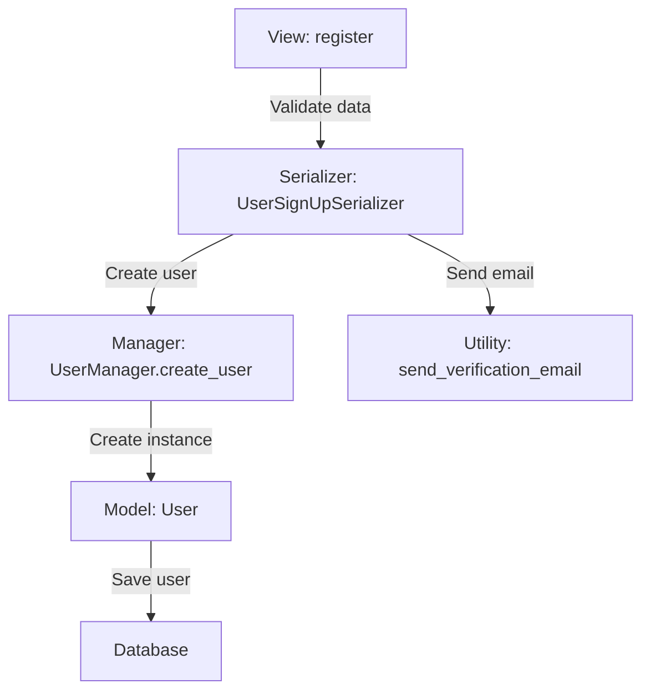

# Django_Rest_Framework
# Project Implementation Roadmap using Django_Rest_Framework
Whenever implementing a project, follow the dynamic approach outlined below. This roadmap will change based on the requirements of the project.

## 1. Project Requirements
- Define and understand the project scope and requirements.

## 2. Features
- List out the key features and functionalities of the project.

## 3. DRF Implementation Approach
- Decide how Django Rest Framework (DRF) will be implemented based on project requirements.
  
## Project Directory Structure
- first Setup the Project Directory Structure

## 4. Entities & Relationships
- Define entities (models) and their relationships (e.g., OneToMany, ManyToMany, etc.).

## 5. Data to be Stored
- Determine what data should be stored in the database (fields, types, etc.).

## 6. DB Design
- Outline the database schema (tables, columns, indexes, etc.).

## 7. Models
- Define models with fields, relationships, and any necessary methods.

## 8. Actions per Feature/Entities
- Specify CRUD operations or custom actions required for the entities and features.

## 9. Views approaches
- **Custom vs. Built-in Views**:
    - Options: `APIView`, `ViewSet`, `GenericAPIView`, `ConcreteAPIView`, `Mixin`, etc.
    - Logic inside views (or validation logic in serializer).
    - Decide if validation logic will be inside the view or in the serializer (or both).

## 10. Serializer
- Handle **validation**, **data transformation**, and linking to model methods for actions like `create`, `update`, etc.
- Use **manager methods** and **serializer methods** for database operations.
  
## 11. Managers
- Create custom managers that use models, utility functions, and serializers to perform business logic.

## 12. Utility Functions
- Create reusable utility functions that interact with models, serializers, and managers for specific operations or logic.

## 13. Data Flow
- **Where data is coming from**: Describe how data is passed into the system.
- **What data is coming**: Define the structure and types of data.
- **How data is accessed/extracted**: Explain how data will be retrieved (e.g., API calls, queries).
- **How data is processed**: Describe any transformations or operations performed on the data.
- **Edge cases**: Identify edge cases for handling data.
- **Serialization/Deserialization**: Specify how data is serialized or deserialized.
- **Output Data**: Define what data will be returned in the output.

---

## Built-in and Custom Options

### Views:
- **Built-in Options**:
  - `APIView`: For basic views where you implement the logic manually.
  - `ViewSet`: For CRUD operations with minimal customization.
  - `GenericAPIView`: For using DRF's generic views with more control.
  - `ConcreteAPIView`: For building a concrete class-based view.
  - `Mixin`: For mixing multiple classes and functionalities.

- **Custom Views**:
  - Views with customized business logic and specific validation.

### Models:
- **Built-in Models**: Use Django’s built-in model types (e.g., `CharField`, `IntegerField`, etc.).
- **Custom Models**: Define custom model methods, managers, or fields as required.

### Managers:
- **Built-in Managers**: Use Django's default manager or override the `Manager` class.
- **Custom Managers**: Implement custom business logic by extending `Manager`.

### Serializer:
- **Built-in Serializers**: Use DRF’s default serializers for simple cases.
- **Custom Serializers**: Implement complex validation, transformation, and custom methods (e.g., for creating or updating records).
- **let's clarify how serializer fields and the validate method work together in a Django REST Framework (DRF) serializer.**
- ## Flow for the serializer working-->
  ***as it is called inside the view the data in view is automatically passed to the serializer and that is then checked the structure of the data, 
`Serializer Fields (like username and password)
Serializer fields like username and password define the structure of the data you expect from the client (front end). They tell the serializer:`
`What fields are expected.
What type each field should be (e.g., CharField, IntegerField).
How to handle the input (e.g., write_only=True to avoid returning sensitive data like a password in the response).
What happens with serializer fields?
When a request is sent to the view (usually through the viewset), the data is passed to the serializer. The serializer then takes that data and:`
  Deserializes it, i.e., transforms it from the raw data (e.g., a JSON object) into a structured Python object that you can work with in your backend code.
Validates the data based on the field types and constraints you defined (like making sure username is a string, and password is valid).
If the data is valid, it is passed into the validate method, where you can add custom validation logic (e.g., checking if the user exists, checking if the password is correct, etc.).
Purpose of the validate Method
The validate method is where you can add custom validation logic. It’s called after the serializer fields have been validated (e.g., checking that the username and password are strings, and that the fields are required or not).
In your case, the validate method does:
Retrieves the values from the serializer fields (the username and password).
Uses custom logic (e.g., authenticate(username=username, password=password)) to check if the credentials are valid.
Returns additional data, such as the authenticated user, if the validation passes.***

  # Understanding Serializer Fields and the `validate` Method in Django REST Framework

## **Summary**

- **Serializer Fields (`username`, `password`)**:
  - Define the structure of the incoming data.
  - Handle basic validation like checking if the fields are of the correct type.
  - Used to **deserialize** the data and convert it into a format that can be worked with on the backend.
  
- **The `validate` Method**:
  - Called after the serializer fields have been validated.
  - Used to implement **custom validation logic**, such as checking if the user exists or if the password is correct.
  - Allows you to raise errors if the validation fails (e.g., invalid credentials).
  
In short, serializer fields handle the data structure and basic validation, while the `validate` method lets you add custom business logic to ensure the data is correct.

## **Flow**

1. **Client sends data** (e.g., `username` and `password`).
2. The **serializer** processes the data:
   - Validates basic field requirements (e.g., is `username` a string? is `password` a string?).
3. If the basic validation passes, the **`validate` method** is called.
   
5. **Custom validation logic** in the `validate` method checks if the credentials are correct (e.g., using `authenticate`).
6. If everything is valid, the **data** is returned (e.g., authenticated user, excluding the password).

## **Example Code**

```python
from rest_framework import serializers
from django.contrib.auth import authenticate

class UserLoginSerializer(serializers.Serializer):
    # Define the fields that will be used to accept input from the client
    username = serializers.CharField(write_only=True)  # Used for username input
    password = serializers.CharField(style={'input_type': 'password'}, write_only=True)  # Used for password input

    def validate(self, attrs):
        # Retrieve the data passed into the serializer fields
        username = attrs.get('username')
        password = attrs.get('password')
        
        # Perform custom authentication logic
        user = authenticate(username=username, password=password)
        if not user:
            raise serializers.ValidationError("Invalid credentials")
        
        # Return the authenticated user if everything is valid
        return {"user": user}
```
### How ModelSerializer Works
**`Field Mapping`:** Each field in the model is automatically mapped to a corresponding serializer field. For example, if username is a CharField in the model, the serializer will generate a CharField for it.
- **Validation:** The ModelSerializer automatically performs basic validation based on the model's field types. For instance:

If username is a CharField with max_length, the serializer ensures the username is within the correct length.
If email is an EmailField, the serializer ensures the email is valid.
**Custom Validation in ModelSerializer**
Although ModelSerializer handles automatic validation based on the model, you can still implement custom validation. You can override methods like validate_<field_name> for specific fields or validate for the entire serializer.
```class UserSerializer(serializers.ModelSerializer):
    class Meta:
        model = User
        fields = ['id', 'username', 'email']

    def validate_username(self, value):
        # Custom validation for the username field
        if 'admin' in value:
            raise serializers.ValidationError("Username cannot contain 'admin'.")
        return value
    
    def validate(self, attrs):
        # Custom validation for the entire serializer (not just individual fields)
        email = attrs.get('email')
        if email and email.endswith('@example.com'):
            raise serializers.ValidationError("Email from example.com is not allowed.")
        return attrs
```
### Explanation:
**validate_username(self, value):** This method validates the username field. It checks if the username contains the word 'admin', and raises a validation error if it does.
**validate(self, attrs):** This method validates the entire set of fields in the serializer. It checks if the email ends with @example.com and raises an error if it does.

## **Key Differences between `Serializer` and `ModelSerializer`**

| **Feature**                | **`Serializer`**                                        | **`ModelSerializer`**                                  |
|----------------------------|---------------------------------------------------------|--------------------------------------------------------|
| **Field Definition**        | You manually define fields (e.g., `CharField`, `IntegerField`). | Fields are automatically generated from the model.    |
| **Validation**              | You manually define validation logic.                   | Basic validation is handled automatically based on the model fields. |
| **Use Case**                | Useful for custom data structures or data not tied to models. | Ideal when working with model-backed data.             |


---

## Django Rest Framework (DRF) Implementation Approaches

DRF can be implemented in various ways depending on your project's requirements. Below is a breakdown of the most common approaches, their use cases, and a decision tree to help you choose the best approach.


## Table of DRF Implementation Approaches

| Approach | Description | When to Use |
|---|---|---|
| API-Only (No Templates) | DRF is used solely for building RESTful APIs. No Django templates are used. | When the frontend is completely separate (e.g., React, Angular, Vue.js). |
| API + Templates (Admin/Simple UI) | DRF provides APIs, and Django templates are used for admin or simple UIs. | When you need a simple frontend or admin interface alongside APIs. |
| Hybrid Approach (API + Templates) | DRF provides APIs, and Django templates are used for rendering the frontend. | When you want a monolithic app with server-rendered templates and APIs. |
| API + Templates for Forms | DRF handles APIs, and Django templates are used for form rendering/handling. | When you need to render and process forms using Django templates. |
| API + Templates for SSR | DRF provides APIs, and Django templates are used for server-side rendering. | When you need to render dynamic HTML pages on the server. |
| API + Templates for Auth | DRF handles APIs, and Django templates are used for auth pages (login, etc.). | When you need to use Django's built-in auth system alongside APIs. |
| API + Templates for Docs | DRF provides APIs, and Django templates are used for custom API documentation. | When you need to create custom API documentation pages. |
| API + Templates for Testing | DRF provides APIs, and Django templates are used for testing/debugging. | During development for testing and debugging purposes. |


## **Decision Tree for Choosing an Approach**

1. **Is your frontend completely separate (e.g., React, Angular, Vue.js)?**

- **Yes** → Use **API-Only (No Templates)**.

- **No** → Proceed to the next question.

- **Do you need server-rendered HTML pages?**

- **Yes** → Proceed to the next question.

- **No** → Use **API-Only (No Templates)**.

- **Do you need to render forms using Django templates?**

- **Yes** → Use **API + Templates for Forms**.

- **No** → Proceed to the next question.

- **Do you need to render dynamic HTML pages on the server?**

- **Yes** → Use **API + Templates for SSR**.

- **No** → Proceed to the next question.

- **Do you need to use Django's built-in authentication system?**

- **Yes** → Use **API + Templates for Auth**.

- **No** → Proceed to the next question.

- **Do you need custom API documentation pages?**

- **Yes** → Use **API + Templates for Docs**.

- **No** → Proceed to the next question.

- **Do you need testing/debugging pages during development?**

- **Yes** → Use **API + Templates for Testing**.

- **No** → Use **Hybrid Approach (API + Templates)**.

**Let’s consolidate all the concepts and approaches you’ve mentioned into a comprehensive guide that covers:**

1. **Dynamic Actions in a Single View**.

2. **Separate Views for Each Action**.

3. **Hybrid Approach (Combining Templates and APIs)**.

4. **Advanced Renderer Usage in DRF**.

5. **Redirection and HTML Rendering in DRF**.

This guide will provide a clear understanding of how to implement these approaches in Django Rest Framework (DRF) and when to use each one.

| Approach                         | Description                                                                                   | When to Use                                                                 |
|----------------------------------|-----------------------------------------------------------------------------------------------|-----------------------------------------------------------------------------|
| Dynamic Actions in a Single View | Handle multiple actions in one view using a parameter (e.g., action).                         | Small applications with simple forms and limited actions.                  |
| Separate Views for Each Action   | Create separate views for each action (e.g., register, signin, logout).                       | Medium to large applications with complex logic for each action.           |
| Hybrid Approach                  | Combine Django templates for server-side rendering with DRF APIs.                            | Monolithic applications with tightly coupled backend and frontend.         |
| Advanced Renderer Usage          | Customize response formats using DRF renderers (e.g., JSON, HTML, plain text).               | When you need to support multiple response formats.                        |
| Redirection and HTML Rendering   | Use redirect and TemplateHTMLRenderer to navigate and render HTML pages.                     | When you need to redirect users and render HTML templates.                |

---

## **6. Combining All Approaches**

You can combine the above approaches to build a flexible and powerful application. For example:

- Use **separate views** for each action.

- Use **templates** for server-side rendering.

- Use **APIs** for dynamic functionality.

- Use **renderers** to support multiple response formats.

- Use **redirection** to navigate between pages.

### **Example Workflow**

1. **User visits the home page** (`/`):

- Render an HTML template using `TemplateHTMLRenderer`.

- **User submits a form**:

- Handle the form submission in a DRF view.

- Use `redirect` to navigate to another page.

- **User requests data in JSON format**:

- Use `JSONRenderer` to return a JSON response.

- **User requests data in plain text format**:

- Use a custom `PlainTextRenderer` to return a plain text response.


## **Summary of Approaches**

| Approach | Description | When to Use |
|---|---|---|
| Dynamic Actions in a Single View | Handle multiple actions in one view using a parameter (e.g., action). | Small applications with simple forms and limited actions. |
| Separate Views for Each Action | Create separate views for each action (e.g., register, signin, logout). | Medium to large applications with complex logic for each action. |
| Hybrid Approach | Combine Django templates for server-side rendering with DRF APIs. | Monolithic applications with tightly coupled backend and frontend. |
| Advanced Renderer Usage | Customize response formats using DRF renderers (e.g., JSON, HTML, plain text). | When you need to support multiple response formats. |
| Redirection and HTML Rendering | Use redirect and TemplateHTMLRenderer to navigate and render HTML pages. | When you need to redirect users and render HTML templates. |


## **Decision Tree for Choosing an Approach**

1. **Is your frontend completely separate (e.g., React, Angular, Vue.js)?**

- **Yes** → Use **API-Only (No Templates)**.

- **No** → Proceed to the next question.

- **Do you need server-rendered HTML pages?**

- **Yes** → Proceed to the next question.

- **No** → Use **API-Only (No Templates)**.

- **Do you need to handle multiple actions in one view?**

- **Yes** → Use **Dynamic Actions in a Single View**.

- **No** → Use **Separate Views for Each Action**.

- **Do you need to support multiple response formats (e.g., JSON, HTML)?**

- **Yes** → Use **Advanced Renderer Usage**.

- **No** → Use **Hybrid Approach**.

- **Do you need to redirect users and render HTML templates?**

- **Yes** → Use **Redirection and HTML Rendering**.

- **No** → Use **Hybrid Approach**.

  ---
  # Guide to Backend API Development in Django & Django REST Framework

## 1. How to Start a New Project

### 1.1 Understand the Requirements:
- **Entities**: Identify the entities you are working with (e.g., `BankAccount`, `Deposit`).
- **Actions**: Determine the actions your API needs to perform (e.g., Create Deposit, Get Account Balance).
- **Data**: What data needs to be stored (e.g., `account_number`, `balance`, `amount`, etc.)?

### 1.2 Set Up Your Django Project and App:
1. **Create a new Django project**:
    ```bash
    django-admin startproject bank_system
    cd bank_system
    ```

2. **Create a Django app**:
    ```bash
    python manage.py startapp accounts
    ```

3. **Add the app in `settings.py`**:
    ```python
    INSTALLED_APPS = [
        'accounts',  # Your app
        'rest_framework',  # DRF for API handling
    ]
    ```

4. **Create Models**:
    Define models for your entities:
    ```python
    # accounts/models.py
    from django.db import models

    class BankAccount(models.Model):
        account_number = models.CharField(max_length=20, unique=True)
        account_holder = models.CharField(max_length=100)
        balance = models.DecimalField(max_digits=10, decimal_places=2)

    class Deposit(models.Model):
        account = models.ForeignKey(BankAccount, on_delete=models.CASCADE)
        amount = models.DecimalField(max_digits=10, decimal_places=2)
        deposit_date = models.DateTimeField(auto_now_add=True)
    ```

5. **Create Serializers**:
    Define serializers to convert models into JSON and vice versa:
    ```python
    # accounts/serializers.py
    from rest_framework import serializers
    from .models import BankAccount, Deposit

    class DepositSerializer(serializers.ModelSerializer):
        class Meta:
            model = Deposit
            fields = ['amount', 'deposit_date']
    
    class BankAccountSerializer(serializers.ModelSerializer):
        class Meta:
            model = BankAccount
            fields = ['account_number', 'account_holder', 'balance']
    ```

6. **Create Views for Your API**:
    Define views for handling requests:
    ```python
    # accounts/views.py
    from rest_framework import generics
    from .models import BankAccount, Deposit
    from .serializers import DepositSerializer, BankAccountSerializer
    from rest_framework.exceptions import NotFound
    from django.db.models import Sum

    class DepositListView(generics.ListCreateAPIView):
        serializer_class = DepositSerializer

        def get_queryset(self):
            account_number = self.kwargs['account_number']
            try:
                bank_account = BankAccount.objects.get(account_number=account_number)
            except BankAccount.DoesNotExist:
                raise NotFound("Bank account not found")
            return Deposit.objects.filter(account=bank_account)

        def perform_create(self, serializer):
            account_number = self.kwargs['account_number']
            bank_account = BankAccount.objects.get(account_number=account_number)
            deposit = serializer.save(account=bank_account)
            bank_account.balance += deposit.amount
            bank_account.save()
            return deposit
    ```

7. **Define URLs**:
    Create URL routes for the views:
    ```python
    # accounts/urls.py
    from django.urls import path
    from . import views

    urlpatterns = [
        path('accounts/<str:account_number>/deposits/', views.DepositListView.as_view(), name='deposit-list'),
    ]
    ```

8. **Test the API**:
    Run the Django development server:
    ```bash
    python manage.py runserver
    ```

    Use Postman or `curl` to test the API.

---

## 3. How to Think About Logic for API Development

### 3.1 Start by Breaking Down the Problem
- **Entities**: Define what data you need to store (e.g., `BankAccount`, `Deposit`).
- **Actions**: What will the API do? (e.g., Create Deposit, Get Balance).
- **Data Flow**: Input (user request), Processing (business logic), Output (response).

### 3.2 Define Data Flow
- **Inputs**: What data is coming into the system? (e.g., deposit amount, account number).
- **Processing**: How will the data be processed? (e.g., create deposit, update balance).
- **Outputs**: What data will be returned? (e.g., account balance, success message).

### 3.3 Handle Edge Cases
- Invalid account number.
- Negative or zero deposit amounts.
- Unexpected errors during processing.

### 3.4 Write Tests
- Write unit tests for views.
- Test edge cases to ensure proper handling of input and logic.

---

## 4. How to Know the Data Flow Execution

1. **Models**: Understand the relationships between your data entities.
2. **Views**: Views process the data and return a response.
3. **Request Flow**: A request enters the system, goes through URL matching, is handled by the appropriate view, and the response is returned to the user.

---

## 5. Next Steps for Backend Development in Django

### 5.1 Practice Small APIs
- Start with simple CRUD operations and progressively add more complexity.

### 5.2 Focus on Testing
- Write unit tests for each view and API endpoint.

### 5.3 Authentication
- Implement authentication (JWT, OAuth, etc.) for a secure API.

### 5.4 Pagination, Filtering, Sorting
- Learn to implement pagination and filtering for large datasets.

### 5.5 Explore DRF Features
- Familiarize yourself with `ViewSets`, `ModelViewSets`, and other DRF tools to make your development more efficient.

---

## Conclusion

Backend development in Django and DRF requires a structured approach. By breaking down problems into smaller tasks (models, views, serializers), and thinking about data flow, you can gradually build up your skills. Don’t be afraid to tackle small projects, and remember to handle edge cases and test your code thoroughly.

## . Scenarios for Implementing Functionality

### 1 When to Use Serializer for Logic
- **Field Validation**: Use the serializer to validate individual fields (e.g., check if an email is valid).
- **Custom Validation**: Use the serializer's `validate` method for custom checks (e.g., password and confirm password match).
- **Data Transformation**: Use the serializer to preprocess data (e.g., hashing passwords).
- **Database Operations**: Use the serializer’s `create` or `update` methods for saving or updating records.

### 2 When to Use View for Logic
- **Authentication**: Handle authentication logic (e.g., calling Django’s `authenticate` function) in the view.
- **Token Generation**: Use the view to generate and return tokens for authenticated users.
- **Custom Response Handling**: Use the view to customize the response (e.g., custom error messages or status codes).

# Summary of Scenarios, Key Takeaways, and Code Examples

## 1. **Summary of Scenarios**

### 1.1 **When to Use Serializer for Logic**
- **Field Validation**: Validate individual fields like email or password.
- **Custom Validation**: Implement logic for custom validations (e.g., matching passwords).
- **Data Transformation**: Preprocess data (e.g., hashing passwords).
- **Database Operations**: Use serializer methods (`create` or `update`) to save or modify database records.

### 1.2 **When to Use View for Logic**
- **Authentication**: Handle user authentication in the view (e.g., `authenticate` function).
- **Token Generation**: Generate and return authentication tokens for logged-in users.
- **Custom Response Handling**: Customize responses, such as returning specific error messages or status codes.

---

## 2. **Key Takeaways**

### 2.1 **Use the Serializer for:**
- **Data Validation**: Ensures that incoming data is valid before saving.
- **Data Transformation**: Can manipulate or transform data (e.g., hashing passwords).
- **Database Operations**: The `create` or `update` methods save or modify data in the database.

### 2.2 **Use the View for:**
- **Authentication**: Authenticate users based on their credentials.
- **Token Generation**: Handle token generation for authenticated users.
- **Custom Response Handling**: Customize responses (success or error) returned to the user.

### 2.3 **Separation of Concerns:**
- The **serializer** focuses on **data validation** and **database operations**.
- The **view** handles the **business logic**, such as **authentication** and **token generation**, and responds to the client.

---

## 3. **Code Examples**

### 3.1 **User Registration Serializer**
```python
class UserRegistrationSerializer(serializers.ModelSerializer):
    password = serializers.CharField(style={'input_type': 'password'}, write_only=True)
    confirm_password = serializers.CharField(style={'input_type': 'password'}, write_only=True)

    class Meta:
        model = User
        fields = ['email', 'password', 'confirm_password']
        extra_kwargs = {'password': {'write_only': True}}

    def validate(self, data):
        password = data.get('password')
        confirm_password = data.get('confirm_password')
        if password != confirm_password:
            raise serializers.ValidationError('Password is not valid')
        return data

    def create(self, validated_data):
        validated_data.pop('confirm_password', None)
        return User.objects.create_user(**validated_data)
```
### 3.2 **User Login Serializer**
```class UserLoginSerializer(serializers.ModelSerializer):
    class Meta:
        model = User
        fields = ['email', 'password']
```
### 3.3 **User registration view**
```class UserRegistrationView(APIView):
    renderer_classes = [UserRenderers]

    def post(self, request, format=None):
        serializer = UserRegistrationSerializer(data=request.data)
        if serializer.is_valid(raise_exception=True):
            user = serializer.save()
            token = get_tokens_for_user(user)
            return Response({'message': 'User created successfully', 'user_data': user, 'token': token}, status=status.HTTP_201_CREATED)
        return Response(serializer.errors)
```
### 3.4 **User Login view**
```class UserLoginView(APIView):
    renderer_classes = [UserRenderers]

    def post(self, request):
        serializer = UserLoginSerializer(data=request.data)
        if serializer.is_valid(raise_exception=True):
            email = serializer.data.get('email')
            password = serializer.data.get('password')
            user = authenticate(email=email, password=password)
            if user is not None:
                token = get_tokens_for_user(user)
                return Response({'message': 'Login successful', 'user_data': user, 'token': token}, status=status.HTTP_200_OK)
            else:
                return Response({'errors': {'non_field_errors': ['Password or email is not valid']}}, status=status.HTTP_404_NOT_FOUND)
```

---
# Understanding Serializer Methods: `create()`, `save()`, `update()`, `delete()`

## 1. `create()` vs `save()`

### `create()` method:
- The **`create()`** method in serializers is explicitly called when you want to create a new instance of the model.
- **`create()`** **requires** the validated data passed explicitly to it.
- It's used when **creating** a new object (e.g., signing up a new user or creating a new record in your database).

```python
def create(self, validated_data):
    # Use validated_data to create a new user
    return User.objects.create_user(
        email=validated_data['email'],
        password=validated_data['password']
    )
```
DRF internally calls create() when you call `serializer.save()` and are creating a new object.
- `save()` **method**:
The `save()` method is a more general method that can either `create` or `update` an object.
When calling `serializer.save()`, it decides whether to create a new instance `(using create())` or update an existing instance `(using update())`.

```def save(self):
    # This is called when save() is triggered
    if self.instance:
        return self.update(self.instance, self.validated_data)
    else:
        return self.create(self.validated_data)
```
In most cases, you don’t need to manually call `create()` or `update()`. DRF handles this logic when you call `serializer.save()`
### 2. update() Method:
- The `update()` method is used to update an **existing** model instance.
- When you have an existing object `(i.e., self.instance is not None)`, DRF calls the `update()` method to apply changes.

```def update(self, instance, validated_data):
    # Assuming we are updating a user
    instance.email = validated_data.get('email', instance.email)
    instance.password = validated_data.get('password', instance.password)
    instance.save()  # Save the updated instance
    return instance
```
**Flow for update:**
- When updating an **existing** instance, `save()` calls the `update()` method to apply changes to that instance.

**3. `delete()` Method:**
- `delete()` is not implemented directly in serializers but is part of Django's model deletion logic.
- Deleting an object is handled via a **view**, such as `APIView` or `ViewSet`, not inside the serializer.
  Example in view:
  
```@api_view(['DELETE'])
def delete_user(request, pk):
    user = User.objects.get(pk=pk)
    user.delete()
    return Response({"message": "User deleted successfully."})
```
### Summary of Key Differences:
`create():`
- Creates a **new** instance of the model.
- It's explicitly called when creating an object.
  
`save():`
- A **general method** that either **creates or updates** an instance.
- It automatically calls either `create()` (for new objects) or `update()` (for existing objects).
  
`update():`
- Used for **updating** an existing model instance.
- You manually implement this to modify an existing object.
  
`delete():`
- **Not implemented in serializers** but handled by Django's ORM in views.

### Example of Full Flow:
**Creating a user:**
When creating a new user, DRF will call `create():`

```class UserSerializer(serializers.ModelSerializer):
    class Meta:
        model = User
        fields = ['email', 'password']

    def create(self, validated_data):
        return User.objects.create_user(
            email=validated_data['email'],
            password=validated_data['password']
        )
```
**Updating a user:**

When updating a user, DRF will call `update():`

```class UserSerializer(serializers.ModelSerializer):
    class Meta:
        model = User
        fields = ['email', 'password']

    def update(self, instance, validated_data):
        instance.email = validated_data.get('email', instance.email)
        instance.password = validated_data.get('password', instance.password)
        instance.save()  # Save the updated instance
        return instance
```
**Flow in the View:**

```@api_view(['POST', 'PUT'])
def user_view(request, pk=None):
    if pk:
        user = User.objects.get(pk=pk)
        serializer = UserSerializer(user, data=request.data, partial=True)
    else:
        serializer = UserSerializer(data=request.data)
    
    if serializer.is_valid():
        serializer.save()  # This will call create or update based on existence of `user`
        return Response(serializer.data)
    return Response(serializer.errors, status=400)
```
**Conclusion:**
- `create()` is called explicitly to create a new object (you pass `validated_data` to it).
- `save()` is a more generic method that either creates or updates an object, depending on whether it's a new object or an existing one. The `save()` method in a serializer is **implicitly called** after the serializer has been `validated`. You don’t need to pass `validated_data` to `save()` because DRF handles this `internally`. When you call `serializer.is_valid()`, the serializer validates the data and **automatically** `fills` `validated_data` with the `cleaned_data`, which is then used by the `save()` method.

```def save(self):
    email = self.validated_data['email']
    password = self.validated_data['password']
    # Logic for reset ...
```
- The `validated_data` is passed to the `create()` or `update()` method explicitly by DRF when creating or updating a user. This is why you can access validated_data['data'] directly inside the serializer as this data is passed from the view side.
- `update()` is used to update an existing object.
- `delete()` is handled by Django ORM and is typically used within views, not serializers.
## Django Signals

  `Django provides several built-in signals that can be used to trigger specific actions in response to certain events`. For example, `the pre_save and post_save signals are sent before and after an object is saved to the database`, respectively. Similarly, `the pre_delete and post_delete signals are sent before and after an object is deleted from the database`.
  
for furthere details you can read the details from this link--> https://www.sitepoint.com/understanding-signals-in-django/#settingupadjangoproject

### 1-Model signals
Model signals are signals sent by the model system. These are signals sent when various events take place or are about to take place in our models. We can access the signals like so: django.db.models.signals.<the_signal_to_use>
**`pre_save,post_save`**
### 2-Request/response signals
***request_started**
This signal is sent when Django starts processing a request.
***request_finished***
This signal is sent when Django finishes sending a HTTP response to a client.

### how to use the Custom Signals
**Connecting signals in apps.py**
So as to make the signal sending and receipt functionality available throughout the lifecycle of the application, we have to connect the signals in the app configuration file. We’re going to do this for all those  applications in which we have the singals.py files.
```
# library/apps.py
def ready(self):
    import library.signals
```
- `This addition in both apps ensures that signals will be sent when the request response cycle begins.`
  
**Creating the signal sender**.
`Django provides two methods to enable signal sending. We can use Signal.send() or Signal.send_robust(). Their difference is that the send() method does not catch any exceptions raised by receivers.`
To send a signal, the method takes the following format:

```Signal.send(sender, **kwargs)```

**or**
`to use in the project`

```# orders/views.py
from django.shortcuts import get_object_or_404
from django.http import HttpResponse
from django.dispatch import receiver
from orders.models import Order

def confirm_order(request, order_id):
    if request.method == 'POST':
        order = get_object_or_404(Order, id=order_id)

        # Perform order confirmation logic here

        # Send the order_confirmed signal
        # the sender of the signal is the order that just been confirmed
        order_confirmed.send(sender=order)

        return HttpResponse(f"Order {order_id} confirmed successfully.")
    else:
        return HttpResponse("Invalid request method. Use POST to confirm the order.")
```
**Connecting a signal handler (receiver)**
A signal handler is a function that gets executed when an associated signal is sent. Django provides two ways of connecting a handler to a signal sender. `We can connect the signal manually, or we can use the receiver decorator`.
**Manual connection**
If we choose to do it manually, we can do it this way:
```# products/signals.py
from orders.signals import order_confirmed
order_confirmed.connect(<the_signal_handler_function>)
```
**Using the decorator**
`Using the @receiver decorator`, we’re able to associate a signal sender with a particular signal handler. Let’s use this method. `Create a function that will update the inventory when the order_confirmed signal is sent. This handler will be in products app`. Open the products/signals.py file and put it the following code:
```# products/signals.py
from django.dispatch import receiver
from orders.signals import order_confirmed

@receiver(order_confirmed)
def update_quantity_on_order_confirmation(sender, **kwargs):
    """
    Signal handler to update the inventory when an order is confirmed.
    """
    # Retrieve the associated product from the order
    product = sender.product

    # Update the inventory
    product.quantity -= sender.quantity
    product.save()

    print(f"Quantity updated for {product.name}. New quantity: {product.quantity}")
```
The `handler function` should always take in a sender and &ast;&ast;kwargs arguments. Django will throw an error if we write the function without the &ast;&ast;kwargs arguments. That is a pre-emptive measure to ensure our handler function is able to handle arguments in future if they arise.
### How to use built-in signals in a project
`Using built-in signals in a project is not so different from using custom signals. The only difference is that we don’t need to manually initialize sending the signal, since it’s sent out automatically by the framework whether there’s a receiver registered or not. In other words, we don’t have to explicitly call a methods like Signal.send() to trigger built-in signals, as Django takes care of that.`

`To use signals in Django`, you first `define the signal (i.e., the message)` that `you want to send`. `This is typically done by creating an instance of the django.dispatch.Signal class`. `You can then connect one or more receivers to the signal using the signal.connect() method`. `When the signal is sent, all connected receivers are called with the sender and any additional data that was provided`.

`models.py:`

```models.py:
from django.contrib.auth.models import User
from django.db.models.signals import post_save
from django.dispatch import receiver

class Profile(models.Model):
    user =
        ...

    def __str__(self):
        ...

    def create_profile(sender, instance, created, **kwargs):
        if created:
            Profile.objects.create(user=instance)
            print('****************')
            print('Profile created!')
            print('****************')

    post_save.connect(create_profile, sender=User)

    def update_profile(sender, instance, created, **kwargs):
        if created is False:
            instance.profile.save()
            print('****************')
            print('Profile Updated!')
            print('****************')

    post_save.connect(update_profile, sender=User)
```

Above’s an example of how signals can be used in Django ☝️

In this example, we define a `signal` that is triggered after an instance of User is saved to the database. We then connect a `receiver function (create and update_profile)` to the signal using the `post_save.connect() method`.

- When the `_post_save signal` is sent, the `create_profile() function` will be called with the `sender (User)` and any additional data that was provided.

`signals.py:`

```signals.py
from django.contrib.auth.models import User
from signal_app.models import Profile
from django.db.models.signals import post_save
from django.dispatch import receiver

@receiver(post_save, sender=User)
def create_profile(sender, instance, created, **kwargs):
    if created:
        Profile.objects.create(user=instance)
        print('message')
        print('Profile created!')
        print('message')

#post_save.connect(create_profile, sender=User)

@receiver(post_save, sender=User)
def update_profile(sender, instance, created, **kwargs):
    if created is False:
        instance.profile.save()
        print('message')
        print('Profile Updated!')
        print('message')
#post_save.connect(update_profile, sender=User)
```

- In this example, `we define a signal that is triggered before an instance of User is saved to the database`. We then `connect a receiver function (create & update)` to the `signal using the @receiver decorator`. `When the post_save signal is sent, the create_profile() function will be called with the sender (User) and any additional data that was provided (in case we just log console)`.
  
## WSGI(web server gateway interface)/ASGI(asynchrounous server gateway interface)


### WSGI
As we know a Web server is a program that uses HTTP (Hypertext Transfer Protocol) to serve the files that form Web pages to users, in response to their requests, which are forwarded by their computers’ HTTPclients.
You can visit this link for furthere details: https://medium.com/@ksarthak4ever/django-request-response-cycle-2626e9e8606e
**ASGI AND WSGI** ,Both are interfaces/gateways to communicate/connect the web servers and python web application.ASGI it works asynchrounous and is used for modern long live connections e.g. web-sockets .Also `Fastapi is ASGI based as it works asynchronous`. While WSGI work synchronously used for traditional django applications.that's why django is sychronous as it used WSGI.
`WSGI is a tool created to solve a basic problem: connecting a web server to a web framework. WSGI has two sides: the ‘server’ side and the ‘application’ side. To handle a WSGI response, the server executes the application and provides a callback function to the application side. The application processes the request and returns the response to the server using the provided callback. Essentially, the WSGI handler acts as the gatekeeper between your web server (Apache, NGINX, etc) and your Django project.`

Between the server and the application lie the middlewares. You can think of middlewares as a series of bidirectional filters: they can alter (or short-circuit) the data flowing back and forth between the network and your Django application.

***The Big Picture — Data Flow
When the user makes a request of your application, a WSGI handler is instantiated, which:
imports your settings.py file and Django’s exception classes.
loads all the middleware classes it finds in the MIDDLEWARE_CLASSES or MIDDLEWARES(depending on Django version) tuple located in settings.py
builds four lists of methods which handle processing of request, view, response, and exception.
loops through the request methods, running them in order
resolves the requested URL
loops through each of the view processing methods
calls the view function (usually rendering a template)
processes any exception methods
loops through each of the response methods, (from the inside out, reverse order from request middlewares)
finally builds a return value and calls the callback function to the web server***

Let’s get started.

`Layers of Django Application
Request Middlewares
URL Router(URL Dispatcher)
Views
Context Processors
Template Renderers
Response Middlewares
Whenever the request comes in it is handled by the Request middlewares. We can have multiple middlewares. we can find it in project settings(settings.py). Django request middlewares follows the order while processing the request. Suppose if we have request middlewares in the order A, B, C then the request first processed by the middleware A and then B and then C. Django comes up with bunch of default middlewares. We can also write our own or custom middlewares. After request processed by the middlewares it will be submitted to the URL Router or URL dispatcher.`

`URL Router will take the request from the request middleware and it takes the URL Path from the request. Based on the url path URL router will tries to match the request path with the available URL patterns. These URL patterns are in the form of regular expressions. After matching the URL path with available URL patterns the request will be submitted to the View which is associated with the URL.`

`Now, we are in business logic layer Views. Views processes the business logic using request and request data(data sent in GET, POST, etc). After processing the request in the view the request is sent context processors, by using the request context processors adds the context data that will help Template Renderers to render the template to generate the HTTP response.`

`Again the request will send back to the Response middlewares to process it. Response middlewares will process the request and adds or modifies the header information/body information before sending it back to the client(Browser). After the browser will process and display it to the end user.`

### Middlewares
`Middlewares are employed in a number of key pieces of functionality in a Django project: for example :~ we use CSRF middlewares to prevent cross-site request forgery attacks. They’re used to handle session data. Authentication and authorization is accomplished with the use of middlewares. We can write our own middleware classes to shape (or short-circuit) the flow of data through your application.`
***These are the functions that have the access to the request and response object and next middleware function in application request-response cycle.It performs changes to request and response objects.End reqeust response cycle.call the next middleware function.***

---
### CORS(cross origin request sharing)
`when an web app on one domain attempts to access resources from antoher domain/url without proper permisssion.this is security feature implemented by browser`

---
  ## Django Component Interactions(models,serializers,views,utility functions,customs and built-in functionalities)
This document outlines how Django components—models, managers, serializers, views, and utility functions—can interact with each other. This includes use cases, integration patterns, and flow diagrams.

### Tabular Summary

| **Component**        | **Interacts With** | **How**                                                                                                             | **Example**                                                                                                     |
|-----------------------|--------------------|---------------------------------------------------------------------------------------------------------------------|-----------------------------------------------------------------------------------------------------------------|
| **Model**            | Manager            | Uses the custom manager for object creation, retrieval, and querying.                                              | `User.objects.create_user(email, password)`                                                                    |
| **Model**            | Serializer         | Serializer maps data to/from the model fields.                                                                     | Serializer `Meta` class specifies the model and fields.                                                        |
| **Model**            | Views              | Passed to views for CRUD operations.                                                                                | `user = User.objects.get(pk=1)`                                                                                |
| **Model**            | Utility Functions  | Utility functions operate on model instances for business logic.                                                   | `send_verification_email(user)`                                                                                |
| **Manager**          | Model              | Acts as a helper for the model, providing custom query methods.                                                     | `class UserManager(BaseUserManager)`                                                                           |
| **Manager**          | Serializer         | Provides object creation or querying methods used in serializers.                                                   | `User.objects.create_user(...)`                                                                                |
| **Manager**          | Views              | Used directly in views for object creation or querying.                                                             | `User.objects.filter(is_active=True)`                                                                          |
| **Manager**          | Utility Functions  | Utility functions call manager methods to interact with the database.                                               | `active_users = User.objects.get_active_users()`                                                               |
| **Serializer**       | Model              | Maps validated data to create or update model instances.                                                            | `serializer.save()` calls `create` or `update` methods to manipulate model instances.                          |
| **Serializer**       | Views              | Handles input validation and outputs serialized data for API responses.                                             | `serializer = UserSerializer(data=request.data)`                                                               |
| **Serializer**       | Manager            | Uses manager methods for custom object creation logic.                                                              | `User.objects.create_user(...)` inside the `create` method of a serializer.                                     |
| **Serializer**       | Utility Functions  | Utility functions can be called in the `create` or `update` methods for additional logic.                           | `send_verification_email(user)` inside a serializer’s `create` method.                                         |
| **View**             | Serializer         | Uses serializers to handle input and output data for HTTP requests.                                                 | `serializer = UserSerializer(data=request.data)`                                                               |
| **View**             | Model              | Directly queries or updates model instances.                                                                        | `user = User.objects.get(email=email)`                                                                         |
| **View**             | Manager            | Calls manager methods to fetch or manipulate data.                                                                  | `User.objects.filter(is_active=True)`                                                                          |
| **View**             | Utility Functions  | Calls utility functions for actions like sending emails or business logic.                                          | `send_verification_email(user)`                                                                                |
| **Utility Functions**| Model              | Accepts model instances as arguments for operations like email notifications.                                       | `send_verification_email(user)`                                                                                |
| **Utility Functions**| Serializer         | Can be invoked inside serializers during `create` or `update` for additional operations.                           | `send_verification_email(user)` inside `serializer.save()`                                                     |
| **Utility Functions**| Views              | Called in views to handle non-HTTP specific logic, such as sending verification emails or background tasks.          | `if send_verification_email(user):`                                                                            |
| **Utility Functions**| Manager            | Can utilize manager methods for fetching or manipulating data during operations.                                    | `users = User.objects.get_active_users()`                                                                      |

---

### Flow Diagram
#### General Interaction Flow Between Components
1. **Views**:
   - Accept HTTP requests.
   - Use serializers for input validation and output formatting.
   - Call manager methods or utility functions for business logic.
   - Return HTTP responses.

2. **Serializers**:
   - Validate incoming data.
   - Use manager methods for custom object creation or updates.
   - Optionally call utility functions for additional operations.

3. **Managers**:
   - Provide custom query methods and handle complex data-fetching logic.
   - Used by models, serializers, and utility functions.

4. **Models**:
   - Define the database schema and structure.
   - Interact with managers for object manipulation.
   - Passed as arguments to utility functions.

5. **Utility Functions**:
   - Contain reusable logic like sending emails or performing calculations.
   - Accept models, serializers, or raw data as input.

#### Flow Example: User Registration


---

### Key Takeaways
- **Encapsulation**: Each component has a defined responsibility, making the code modular and maintainable.
- **Reusability**: Utility functions, managers, and serializers can be reused across multiple views.
- **Separation of Concerns**: Logic for input validation, object creation, querying, and response formatting is separated across serializers, managers, and views.
- **Flexibility**: The interaction between components is highly customizable, allowing easy extension of functionality.


**Deserialization**

For this flow

Extract data from request body

As it is in stream mean in bytes so parse it in python data through JSON parser and then this python data pass to the serializer and after validation will be saved and then simple show the message of data created successfully

Here serializer working for both serialization (which get the model instance and the pass to the serializer and the convert to json through JSON renderer and then send to the front end and its mostly for just data reading)and ***deserialization involve create, update delete actions***

**Field level validation** 
```python
def validate_fieldname(self):
    # Condition
```

### Object level mean validation on multiple fields

```Def validate(self,data):

name=data.get("name")
```

### Validators

These are used when we have to do the most repeated validation

Def functionname():
Condition
name=serializer.charfield(others_params,validators[functionname])

### Modelform/model serializer

These are similar mean we don't need to create the fields but automatically creates and validators applies on them,nd automatically do for creates, update

As we were creating firstly class by using serializer.serializer but now we will create by using serializer.modelserializer

Now just use the meta class and write the fields name which you are required ,if we want to validate a specific field then just write above the meta class as

Name=serializer.charfield(params,validators[functionname]) also here in this field you can make it read only =true

And if for multiple fields you want to read only then just write under the meta class

Similar validation for one field using function under the meta class

Similar for object level validation

Validators on specific field if repeatedly need the validation using validators inside the field

**View** mostly we say to functions, but **APIview** is for classes which provides the requests methods as per request is hit i.e. get,post and all other methods and we have to define all these methods in this sub Apiview class and then this class will serve the methods as per request is hit,and it has a lot of methods i.e. query_set and other so see documentation for this

**Mixin**it provides all the common behavior like CRUD operations on table its provides the functionalities so just use them,mean we don't need to write the queryset codes ,validate and save this is automatically handled by these classes GenericApiview and modelmixin as we have to write again and again the code of CRUD in views but by using these classes we don't need further more

Also these classes use request methods along with returning the methods respect to the applied mixin,we can shorten the code further as by keeping in the same class i.e. the classes which don't need pk will be in the one class which will inherit the genericapiview,createmodelmixin,listmodelmixin and return the rlevant methods and those group which requires pk will be in the same class other group

**Difference between Apiview**as these provides the requests methods, **genericapiview classes** provides the automatically handled the repeated pattern queryset operations of CRUD on model instance, along with the mixins, while **concreteApiView provides** the same behavior as genericapiview classes but these provides the more customization separately like for Creation,updation deletion etc for these provides the built-in classes like listapiview,createapiview and others etc.Also they provide the classes that handled the combination like for Creation and listening it provides createlistapiview, updateretriveapiview etc

Mean concrete Apiview extends both genericapiview and mixinmodelview and no need both of them anymore when we have the concrete Apiview as it uses the concepts of both of these

**Apiview and viewset** the difference is that viewset provides the action like create,list, CRUD etc instead of methods in Apiview post,get etc, and we can create the CRUD logic at once in the viewset class which will handle automatically CRUD operations on table instances ,router is used for such things which handle the CRUD operations under the sme route including pk etc . The advantage of this class is that repeated set of view logic can be handled under the sme class , router mean no need to define separate URL for those repeated set of view logic

**Modelviewset** is the similar to the above viewset but it's handle the CRUD operations on the instance automatically no need to write the viewset methods separately as above in the viewset and it overrides the methods of apigenericview and uses the concepts of mixin behind the scene

**Authentications:**

**2-Session authentication**

**3-token authentication**

**4-custom authentication**

**5-jwt authentication**
this bascially involves the atuhentication withou using the db as othere use the db for storign the token and accessing it ,but its cons is that it do issue for peromfrmance if many requests done,so here jwt come,it uses token which has 3 parts for information i.e. headers,payload,jwt id,user id and other etc.this is safe for api requesting ,to use it in django we use built in classes in urls.py file like import them `obtainparitoken`,`refreshtoken`,`verifytoken` from jwt and make url for each class,and set the other factors for it like time for refresh token,bearer type etc. ***to use either Globally set in settings.py file along with factors***,to use it in ***view,first import jwtauthentication from jwt,and then use it in that specific view for which you have to set it for authentication and use it like similar ,permisssion classes and custom authentication***

#### Set Environment Variables
***To set the environment variables globally in postman ,1- first crate the environment,2- then this code write in the login end point for default seting the values of access,refresh tokens***
```const responseData = pm.respose.json()
pm.environment.set('access-token',responseData.token.access)
pm.environment.set('refresh-token',responseData.token.refresh)
```

**6-Djoser Authentication**
REST implementation of Django authentication system. djoser library provides a set of Django Rest Framework views to handle basic actions such as registration, login, logout, password reset and account activation. It works with custom user model.
```Available endpoints¶
/users/

/users/me/

/users/resend_activation/

/users/set_password/

/users/reset_password/

/users/reset_password_confirm/

/users/set_username/

/users/reset_username/

/users/reset_username_confirm/

/token/login/ (Token Based Authentication)

/token/logout/ (Token Based Authentication)

/jwt/create/ (JSON Web Token Authentication)

/jwt/refresh/ (JSON Web Token Authentication)

/jwt/verify/ (JSON Web Token Authentication)
```

***Supported authentication backends¶
Token based authentication from DRF
JSON Web Token authentication from django-rest-framework-simplejwt
for furthere visit thsi link:https://djoser.readthedocs.io/en/latest/introduction.html
.***

**Authentications:**

**1-Basic authentication**(it uses HTTP authentication which uses user's username and password for authentication, it's mostly do for the testing purposes but for production then use this over https and re-request user's username and password.

**These permission classes are isauthenticated,allowany,isadmin, Djangomodelpermissiononly, isauthenticatedreadonly,djandomodelpermissionorannotatedonly**

If view are class based then these classes i.e. authentication and permission will be used inside the class but for the function base view these classes will be as decorators above the function ,this authentication and permission was to the specific class or function but what if we have to apply globally authentication and permission to all the classes or functions then add these authentication and permission inside the setting.py file, but what if we don't want to apply the authentication and permission to some class as we have set globally authentication and permission so to do this simple write inside the class or function and it will overwrite the global authentication and permission,also we can set the multiple authentication and permission in the square bracket when we write them there in the function or class

)

**2-Session authentication**(uses Django default session backend for authentication  ,mean the session currently in which user is using the website is authnticated then session provides these things request.user which is the Django instance and request.auth None,if we use ajax session authentication then make sure to use the secure csrf token methods like post,patch,update etc,also for Djangomodelpermissions we have to explicitly assign the permission from admin panel to perform the CRUD operations.

)

**Custom Permission** we have to override the base permission by using either or both of the methods i.e. **has_permission,has_permision_object()**,these methods will be defined the inside the class which will inherit the base permission and now use this inside the api class along the authentication, also there are third parties permission in drf which provides the permission 

**3-token authentication**

**4-custom authentication** (to apply this inherit from base authentication class and override the authenticate method which return tuple as i.e.(user,auth) and then use this custom inside the API class inside the authentication in bracket 

**5-jwt authentication**

**Token authentication**:it is token base http authentication ,its best option when there is desktop and mobile app and to use it configure it in installed app and then make sure migrate as it provides db migrations,if authentication is successful the it provides request.user which is Django instance and request.auth which is token.auth instance ,to use it in production then use https,also to create token for this use Django admin, python manage.py command i.e.

Python manage.py drf_create_toke <username>,by using signal and exposing end points

**Relationship in serializer**, when we make serializer from **model.serializer,there is also another hyperlinkedmodelserializer which is similar to modelserializer** which have relationship with each other on the relatedname param so then this relatedname param will be used also in serializer to access the relationship fields, but this param will return id but what if we want the value then simply in serializer class before meta crete the field and inside it many=True and readonly=True and then use this field inside the feilds to access it

Similar we also create the field related to **primarykey,hyperlinked,slugfield, hyperlinkedidentity fields etc**

Also we can do nested serializer mean when we have to show all the details of other serializer in this one ,so simply write down that serializer and and add this in the fields as a field

**: Filter**

In drf we can override the get_query method to get the results on the filter base ,for current user we can use the request.user this return the current user ,we can also use the Djangofilterbackend for highly customizably filtering ,to use it frst install and set in installed app in setting file for further read the documenation of this,for globally set it in rest_framewrok and to use for per view using genericapiview

SearchFilter it supports single query parameter base search ,to ise it include search_field in in your view ,

OrderingFilter for ordering the results

**Pagination** 

Globally in setting file set it in rest_framework and which class you have to use write it from below described 3 classes

For per view, you can set the pagination class on per view along with the page size mean to show number of records per page

**1-pagenumberpagination**,we can override it by inheritting it as a subclass and then use that in the view, paginationqury_params mean the pagination means pages numbering,if we want to decide the page size by client then we can do page_size_query_params

**2-limitoffpagination**

**3-cursor pagination**

**Throttling** mean to limit the rate of api hitting 

And we can set it in globally in setting file for both annotated user and authorizeduser

3 classes used for per view

As annonthrotleclass,userthrotleclass,scopedthrotleclass,we can customize the these classes for per view use

### Summary of the above topics

#### Deserialization
We use deserialization when performing actions like:
- Create
- Update
- Delete

**Flow:**
1. Extract data from the request body.
2. Since it is in a stream (bytes), parse it into Python data through a JSON parser.
3. Pass this Python data to the serializer.
4. After validation, save it and display a success message: "Data created successfully."

Here, the serializer works for both:
- **Serialization:** Takes the model instance, passes it to the serializer, converts it to JSON through a JSON renderer, and sends it to the front end (mostly for data reading).
- **Deserialization:** Involves actions like create, update, and delete.

#### Field-Level Validation
```python
def validate_fieldname(self):
    # Condition
```

#### Object-Level Validation
Validation on multiple fields:
```python
def validate(self, data):
    name = data.get("name")
```

#### Validators
Used for the most repeated validation:
```python
def functionname():
    # Condition

name = serializer.CharField(others_params, validators=[functionname])
```

#### ModelForm / ModelSerializer
- These are similar as we don't need to create fields manually; they are automatically created, and validators are applied.
- Automatically handles create and update actions.
- Previously, we created classes using `serializer.Serializer`. Now, use `serializer.ModelSerializer`.
- Use the `Meta` class to define the required fields.

**Example:**
```python
name = serializer.CharField(params, validators=[functionname])  # Field-level validation

class Meta:
    fields = ['field1', 'field2']
    read_only_fields = ['field3', 'field4']
```

For multiple read-only fields, define them under the `Meta` class.

#### Views
- Functions are referred to as views.
- `APIView` is for classes, providing request methods (e.g., GET, POST).
- Define these methods in the subclass of `APIView`.
- Offers methods like `queryset` and others. Refer to the documentation for more.

#### Mixins
- Provide common behavior (CRUD operations on tables).
- Automatically handle operations like `queryset`, `validate`, and `save`.
- Use classes like `GenericAPIView` and `ModelMixin` to avoid repetitive CRUD code in views.

**Usage:**
- Classes without `pk` can inherit `GenericAPIView`, `CreateModelMixin`, and `ListModelMixin`.
- Classes with `pk` can group related methods.

#### Differences
1. **`APIView`**: Provides request methods.
2. **`GenericAPIView`**: Automatically handles repetitive CRUD operations.
3. **`ConcreteAPIView`**: Extends `GenericAPIView` and `ModelMixin`, offering separate built-in classes (e.g., `ListAPIView`, `CreateAPIView`).
4. **`ViewSet`**: Provides actions like create, list, CRUD, etc., instead of methods (e.g., GET, POST).
5. **`ModelViewSet`**: Similar to `ViewSet`, but automatically handles CRUD operations without defining methods.

#### Authentication
1. **Basic Authentication**: Uses HTTP authentication (username/password). Mostly for testing. Use HTTPS in production.
   ```python
   # Example permission classes:
   IsAuthenticated, AllowAny, IsAdmin, DjangoModelPermission
   ```
2. **Session Authentication**: Uses Django's session backend.
3. **Token Authentication**: Token-based HTTP authentication.
   ```bash
   python manage.py drf_create_token <username>
   ```
4. **Custom Authentication**: Inherit `BaseAuthentication` and override the `authenticate` method.
5. **JWT Authentication**: JSON Web Token-based authentication.

# 📖 Role-Based Access Control (RBAC) along with the permissions in Django

## 🚀 1️⃣ How Roles Can Be Created?
Roles in Django can be created in **three different ways**:

### **1️⃣ Using Django Groups (Recommended)**
- Django has a built-in `Group` model.
- You create groups like `Admin`, `Staff`, and `User`.
- Assign permissions to each group dynamically.

### **2️⃣ Using Custom User Model (Static Role Field)**
- Add a `role` field to the `User` model (`admin`, `staff`, `user`).
- Check the role directly instead of using Django Groups.

### **3️⃣ Using Django Permissions (Fine-Grained Control)**
- Assign **permissions** like `can_add_book`, `can_delete_book` to users.
- Use `has_permission` checks in API views.

---

## 🔑 2️⃣ Where Are Roles & Permissions Set?
| **Level** | **Where Roles Are Created?** | **Where Permissions Are Set?** | **Usage** |
|-----------|------------------|-------------------|---------|
| **Database Level (Model-based roles)** | Add `role` field to `User` model | Custom role-check logic | When roles are static |
| **Group Level (Django Groups)** ✅ | Create groups (`Admin`, `Staff`, `User`) | Assign built-in permissions | Best for dynamic roles |
| **Permission Level (Django Permissions)** | N/A | Assign specific permissions (`can_add_book`, `can_borrow_book`) | Best for fine-grained control |

---

## **1️⃣ Using Django Groups (Recommended Approach)**
This method allows **dynamic role management** via Django’s admin panel.

### **Steps:**
#### **1. Create Groups (`Admin`, `Staff`, `User`)**
```python
from django.contrib.auth.models import Group, Permission

# Create Groups
admin_group, _ = Group.objects.get_or_create(name='Admin')
staff_group, _ = Group.objects.get_or_create(name='Staff')
user_group, _ = Group.objects.get_or_create(name='User')

# Assign Permissions (Example)
permission = Permission.objects.get(codename='add_book')  # Allow Staff to add books
staff_group.permissions.add(permission)
```

#### **2. Assign Users to Groups**
```python
user = User.objects.get(username='john')
user.groups.add(staff_group)  # Now 'john' has Staff permissions
```

#### **3. Restrict Access Using Groups**
```python
from rest_framework.permissions import BasePermission

class IsAdminUser(BasePermission):
    def has_permission(self, request, view):
        return request.user.groups.filter(name='Admin').exists()
```

✅ **Best For:** Large applications with multiple roles that might change dynamically.

---

## **2️⃣ Using a Custom Role Field in the User Model**
If roles are static (e.g., Admin, Staff, User), you can modify the Django `User` model.

### **Modify User Model:**
```python
from django.contrib.auth.models import AbstractUser
from django.db import models

class CustomUser(AbstractUser):
    ROLE_CHOICES = (
        ('admin', 'Admin'),
        ('staff', 'Staff'),
        ('user', 'User'),
    )
    role = models.CharField(max_length=10, choices=ROLE_CHOICES, default='user')
```

### **Use in Permissions:**
```python
from rest_framework.permissions import BasePermission

class IsStaffOrAdmin(BasePermission):
    def has_permission(self, request, view):
        return request.user.is_authenticated and request.user.role in ['admin', 'staff']
```

✅ **Best For:** When roles are predefined and don’t need frequent updates.

---

## **3️⃣ Using Django’s Built-in Permissions**
Django provides four default permissions for each model:
- `add_<modelname>`
- `change_<modelname>`
- `delete_<modelname>`
- `view_<modelname>`

### **Assign Permissions:**
```python
from django.contrib.auth.models import Permission

permission = Permission.objects.get(codename='add_book')
user.user_permissions.add(permission)
```

### **Check Permissions in Views:**
```python
from rest_framework.permissions import DjangoModelPermissions

class BookViewSet(viewsets.ModelViewSet):
    permission_classes = [DjangoModelPermissions]
```

✅ **Best For:** Fine-grained access control (e.g., allowing some staff to edit books but not delete them).

---

## **How It Works in Your Current Code**
Your **current implementation** mostly follows the **permissions-based approach** but lacks **Groups-based access control**.

### **1. Permissions Applied in Your Code:**
- `IsAdminOrReadOnly` → Only admins can modify books/authors.
- `IsAdminOrStaff` → Admins and staff have more access.
- `IsAuthenticated` → Only logged-in users can borrow books.

### **2. Where to Improve?**
- **Use Django Groups** (`Admin`, `Staff`, `User`) to manage access **dynamically**.
- Assign `Group`-based access to views instead of hardcoded permissions.

---

## **Final Recommendation**
If your app has multiple user roles and **you want dynamic control**, **Django Groups** is the best approach.

## 🎯 3️⃣ What’s Happening Behind the Scenes?  

### **⚡ Before (Your Code Was Doing This)**
❌ Only checking `is_staff`, which is a built-in Django field.  
❌ No concept of “User Roles” explicitly.  
❌ Harder to manage if new roles (like "Librarian") are needed.  

### **✅ After (With Groups & Permissions)**
✔ Users are assigned to **Groups** (`Admin`, `Staff`, `User`).  
✔ Views check if the user **belongs to a group** instead of just `is_staff`.  
✔ Easier to manage **roles dynamically** (e.g., add a new "Librarian" role later). 

---

## 🏆 5️⃣ Final Answer to Your Question

### **Q: Where are roles being created?**
✔ By default, Django does **NOT** create roles explicitly.  
✔ We create roles using **Django Groups** (`Admin`, `Staff`, `User`).  

### **Q: Where are permissions being set?**
✔ Django has **built-in permissions** (`add_book`, `delete_book`, etc.).  
✔ We assign these permissions to **Groups** (`Admin`, `Staff`).  
✔ Your **custom permission classes** (`IsAdminOrReadOnly`, `IsAuthenticated`) enforce them.  

### **Q: How do roles and permissions interact?**
✔ **Roles (Groups)** bundle multiple **permissions** together.  
✔ **Users are assigned roles** (via Groups).  
✔ **Permissions are applied** based on roles.

---

## 🎯 6️⃣ What Should You Do Next?

✅ **Option 1:** Modify your code to use **Django Groups** for role-based access.  
✅ **Option 2:** Keep your current setup, but apply finer **role-based permissions**.  

**Would you like me to modify your code to use Groups for better role management?** 🚀

#### Permissions
- Specific to classes or functions using decorators or inside the class.
- For global authentication and permissions, add them in `settings.py`.

#### Custom Permissions
Override `BasePermission`:
```python
class CustomPermission(BasePermission):
    def has_permission(self, request, view):
        # Logic
```

#### Relationships in Serializer
- Use `HyperlinkedModelSerializer` for relationships.
- To display values instead of IDs, define the field with `many=True` and `read_only=True`.
- Nested serializers can show details of other serializers.

#### Filters
- Override `get_queryset` for filtered results.
- Use `DjangoFilterBackend` for customizable filtering.

#### Search Filter
Supports single query parameter-based search:
```python
search_fields = ['field1', 'field2']
```

#### Ordering Filter
Define ordering in views.

#### Pagination
Set globally in `settings.py` or per view.
1. **PageNumberPagination**
2. **LimitOffsetPagination**
3. **CursorPagination**

#### Throttling
Limits API request rates. Define globally or per view:
- `AnonThrottle` for anonymous users.
- `UserThrottle` for authenticated users.
- `ScopedThrottle` for specific scopes.

**Customization:**
Customize throttle classes for specific views.

## Overview of Generic Views in Django

The generic views supplied by Django abstract away a lot of the boilerplate that comes with a view. The Django developers have identified some common patterns of displaying/interacting with data and basically given us a shortcut.

**ListView**
The ListView will get you list of all objects defined by a model. This is great for a high-level view of a collection of items.

**DetailView**
The DetailView is great for looking at a single item. The Django docs show it being used with a slug — I’m using it with my object’s primary key.

**CreateView**
This view is used for making a new item and persisting it to the database. It will infer fields from your model and can supply a form with the appropriate input types.

**UpdateView**
UpdateView is similar to the CreateView, except that it pre-populates the form with the values found in the database.

**DeleteView**
This will delete the record from the database.

```
from django.views import generic
from django.urls import reverse_lazy

from .models import Server


class ServerIndexView(generic.ListView):
    model = Server


class ServerDetailView(generic.DetailView):
    model = Server


class ServerCreateView(generic.edit.CreateView):
    model = Server
    fields = '__all__'


class ServerEditView(generic.edit.UpdateView):
    model = Server
    fields = '__all__'


class ServerDeleteView(generic.edit.DeleteView):
    model = Server
    success_url = reverse_lazy('inventory:server_index')
```
## DRF Views:
### 1. APIView
In DRF, APIView provides methods for handling HTTP requests like GET, POST, PUT, and DELETE.

```python
# DRF APIView Example
from rest_framework.views import APIView
from rest_framework.response import Response
from .models import Item
from .serializers import ItemSerializer

class ItemListView(APIView):
    def get(self, request):
        items = Item.objects.all()
        serializer = ItemSerializer(items, many=True)
        return Response(serializer.data)
```
### 2. GenericAPIView
GenericAPIView provides built-in mixins for common CRUD operations.
```python
# DRF GenericAPIView Example
from rest_framework.generics import GenericAPIView
from rest_framework.mixins import ListModelMixin
from .models import Item
from .serializers import ItemSerializer

class ItemListView(GenericAPIView, ListModelMixin):
    queryset = Item.objects.all()
    serializer_class = ItemSerializer

    def get(self, request, *args, **kwargs):
        return self.list(request, *args, **kwargs)
```
### 3. ConcreteAPIView
ConcreteAPIView automatically handles common CRUD actions like ListAPIView, CreateAPIView, etc.
```python
# DRF ListAPIView Example
from rest_framework.generics import ListAPIView
from .models import Item
from .serializers import ItemSerializer

class ItemListView(ListAPIView):
    queryset = Item.objects.all()
    serializer_class = ItemSerializer
```
### 4. ViewSet
A ViewSet in DRF provides actions like create, list, retrieve, update, and destroy for models.
```python
# DRF ViewSet Example
from rest_framework.viewsets import ViewSet
from .models import Item
from .serializers import ItemSerializer

class ItemViewSet(ViewSet):
    def list(self, request):
        queryset = Item.objects.all()
        serializer = ItemSerializer(queryset, many=True)
        return Response(serializer.data)
```
 ## Comprehensive table that highlights the major differences, use cases, and purposes of Django views  and DRF views

| **Category**            | **Django Views**                                                                                                                                       | **DRF Views**                                                                                                                                                |
|--------------------------|---------------------------------------------------------------------------------------------------------------------------------------------------------|-------------------------------------------------------------------------------------------------------------------------------------------------------------|
| **Purpose**             | Django views handle web requests and return HTTP responses (HTML, JSON, etc.).                                                                         | DRF views are specialized for building RESTful APIs, returning JSON data for client-server communication.                                                   |
| **Function-Based View** | Defined as a Python function that takes an HTTP request and returns an HTTP response.                                                                  | Not directly applicable; DRF emphasizes class-based views for API design.                                                                                   |
| **Class-Based View**    | Allows views to be implemented as classes, enabling reuse and composition of methods for specific HTTP methods (e.g., `get()`, `post()`).               | APIView serves as the base class, providing methods for various HTTP request types (e.g., `GET`, `POST`, `PUT`).                                             |
| **Examples**            | - `TemplateView`: Renders an HTML template.                                                                                                           | - `APIView`: Handles API requests, acting as the foundation for custom APIs.                                                                                 |
|                          | - `ListView`: Displays a list of objects from a database model.                                                                                      | - `GenericAPIView`: Provides queryset and serializer handling, commonly used with mixins for CRUD functionality.                                             |
|                          | - `DetailView`: Shows details for a single object.                                                                                                  | - `ConcreteAPIView`: Combines GenericAPIView and mixins for actions like list, create, retrieve, update, and delete.                                         |
| **Reusability**         | Django views can use base classes to extend behavior across multiple views.                                                                           | DRF's mixins allow sharing CRUD functionality across views, eliminating the need to rewrite common patterns.                                                 |
| **Mixins**              | Not a primary focus in Django views.                                                                                                                  | DRF offers mixins like `CreateModelMixin`, `UpdateModelMixin`, and `DestroyModelMixin` for quick implementation of CRUD actions.                              |
| **ViewSet**             | Not available in Django; views are defined individually with URLs assigned to them in `urls.py`.                                                     | `ViewSet` groups related actions like create, retrieve, update, and delete into a single class.                                                              |
| **ModelViewSet**        | Not applicable in Django.                                                                                                                             | Extends `ViewSet` and automatically provides CRUD methods for model instances, reducing boilerplate code.                                                    |
| **Routing**             | URLs are explicitly defined in `urls.py`, requiring separate path definitions for each view.                                                         | Uses routers to map ViewSet actions (e.g., `list`, `create`) automatically to URLs.                                                                          |
| **When to Use**         | Use Django views for traditional web applications requiring server-rendered HTML responses.                                                           | Use DRF views for APIs to expose application data to clients via RESTful endpoints, typically in JSON format.                                                |
| **Authentication**      | Implements basic session-based authentication by default.                                                                                            | Supports a wide range of authentication methods, including Session, Token, JWT, and custom authentication.                                                  |
| **Permissions**         | Access control is implemented manually or via Django's permissions system.                                                                            | Provides built-in permission classes like `IsAuthenticated`, `AllowAny`, and `IsAdminUser`.                                                                  |
| **Serialization**       | Not a primary concern in Django views; manual conversion of querysets to JSON/other formats may be required.                                           | Serialization is integral to DRF, with serializers handling data validation, transformation, and deserialization.                                            |
| **Advantages**          | - Simple for basic use cases.                                                                                                                        | - Designed for API development with built-in features like authentication, permissions, serialization, and pagination.                                       |
|                          | - Offers a variety of pre-built class-based views (e.g., `ListView`, `TemplateView`) for rapid development.                                          | - Reduces boilerplate code with features like ViewSets, routers, and mixins.                                                                                 |
| **Drawbacks**           | - Can require more manual work for APIs, such as writing serializers or handling permissions.                                                        | - May feel overly complex for simple views that do not require API functionality.                                                                            |

### 1. Does the `request` object exist in class-based views like `APIView` in DRF?

Yes, the `request` object is always present in both Django and DRF class-based views.

- **In Django:**
  - When you define a method like `get(self, request, *args, **kwargs)`, the `request` object is passed automatically.
  - It represents the HTTP request received by the view and contains data like headers, method, body, GET/POST parameters, etc.

- **In DRF:**
  - The `APIView` class processes the incoming request and wraps it as a DRF `Request` object (a subclass of Django's `HttpRequest`).
  - This `Request` object provides additional functionality for handling content negotiation, parsing (JSON, form data), and authentication.

#### **Why is the `request` object used?**
The `request` object allows the view (whether function-based or class-based) to:
1. Identify the HTTP method (`GET`, `POST`, etc.) used by the client.
2. Access client-provided data (query params, POST data, headers).
3. Authenticate the user (DRF adds user and auth context).
4. Handle client-specific logic based on the request's metadata.

---

### 2. Do these request methods (GET, POST, etc.) perform database operations behind the scenes?

- **In Django views:**
  - The request methods themselves do NOT interact with the database. They only indicate the client's intent.
  - The actual database operations (e.g., `save()`, `filter()`, `update()`) are explicitly performed by the developer in the view logic, usually using Django ORM.

- **In DRF `APIView`:**
  - Similarly, request methods like `GET` or `POST` are not tied to database operations by default.
  - Database interaction happens only if explicitly implemented in the view (e.g., using a serializer to validate and save data).

- **In DRF `ViewSet` or `ModelViewSet`:**
  - Here, CRUD operations on the database are handled behind the scenes.
  - For example, `ModelViewSet` automatically provides:
    - `create()` for `POST`
    - `list()` for `GET`
    - `retrieve()` for `GET` with a specific object
    - `update()` for `PUT/PATCH`
    - `destroy()` for `DELETE`
  
  **How does it work?**
    - These methods internally use Django ORM to perform operations on the model’s database table.

#### **Does it still rely on the request methods?**
Yes! Even in `ViewSet`, the HTTP request methods (`GET`, `POST`, etc.) trigger the corresponding CRUD actions. For example:
- A `POST` request will trigger the `create()` method, which internally uses Django ORM to add an object to the database.

---

### 3. Is it necessary to use the `request` object in every scenario?

No, it’s not always necessary to explicitly use the `request` object. Its usage depends on the scenario:

#### **When to use the `request` object:**
1. **Accessing client-provided data:**
   - For example, in `POST` requests, you might retrieve data from `request.data` (DRF) or `request.POST` (Django).

2. **Checking request type or headers:**
   - Determine whether the client sent a `GET`, `POST`, or `DELETE` request, or check specific headers.

3. **Authentication:**
   - DRF’s `request.user` and `request.auth` provide user and token information for handling permissions.

4. **Conditional logic:**
   - For example, returning different responses based on the request method.

#### **When you don’t need the `request` object:**
- If your view doesn’t depend on request-specific information, such as:
  - Returning a static page (e.g., `TemplateView` in Django).
  - A view that performs a fixed operation regardless of the request content.

---

### 4. Summary: What does it mean to perform database operations based on request methods?

- HTTP request methods (`GET`, `POST`, etc.) don’t directly perform database operations.
- They are used to **map client intent** to server-side logic:
  - `GET`: Read data from the database.
  - `POST`: Insert new data into the database.
  - `PUT/PATCH`: Update existing data.
  - `DELETE`: Remove data from the database.

#### Example:
In `APIView` or `ViewSet`:
- When a `POST` request is made to create a new object:
  - The view processes the request data, validates it with a serializer, and calls ORM methods like `MyModel.objects.create()` to save it to the database.
- When a `GET` request is made to list objects:
  - The view fetches the data using a queryset (e.g., `MyModel.objects.all()`).

---

### Conclusion:
- The `request` object is central to both Django and DRF views, though it may not always need to be explicitly used.
- ViewSets and CRUD actions rely on the request methods to determine the appropriate database operations (via ORM).
- While request methods signal client intent, the actual database operations are controlled by your view logic or DRF's built-in methods in `ViewSet` and `ModelViewSet`.

### AdminPanel:
-This is also created by the same model which we have created for the user either it is end user or admin, to make it admin mean to show all the users details with showing the details in separate profile as he click on that user,to get this set the url with the id to keep it dynamic, for this specific user view and template.**flow for this admin panel working** as the user login either end or admin with the same form then check here type of user and then show the profile to related that user.and also if he want to perform the CRUD operations on his profile ,so after saving then show him updated profile. so this is the overview how it will work.
```
from django.shortcuts import render, redirect
from django.contrib.auth import logout
from .forms import EditUserProfileForm, EditAdminProfileForm
from django.contrib.auth.models import User

# Admin Panel view
def Admin_user_profile(request):
    if request.user.is_authenticated:
        if request.method == "POST":
            if request.user.is_superuser == True:
                fm = EditAdminProfileForm(request.POST, instance=request.user)
                users = User.objects.all()
            else:
                users=None
                fm = EditUserProfileForm(request.POST, instance=request.user)
            if fm.is_valid():
                messages.success(request, 'Profile Updated !!!')
                fm.save()
        else:
            if request.user.is_superuser == True:
                fm = EditAdminProfileForm(instance=request.user)
                users = User.objects.all()
            else:
                users=None
                fm = EditUserProfileForm(instance=request.user)
            return render(request, 'enroll/profile.html', {'name': request.user.username, 'form':fm, 'users':users})
    else:
        return HttpResponseRedirect('/login/')

def user_profile(request,id): #this will be used when on admin side we will click on user and then we will see the profile of that user
    if request.user.is_authenticated:
        pk=User.objects.get(pk=id)
        fm = EditAdminProfileForm(instance=pk)
        return render(request, 'enroll/profile.html', {'name': request.user.username, 'form':fm})
    else:
        return HttpResponseRedirect('/login/')

# Logout
def user_logout(request):
    logout(request)
    return redirect('/login/')
```
---
**Metaclasses**

Metaclasses are also the way of structuring a program like other paradigms with unique functionalities such as the addition/accessibility of the attributes and methods to its instances classes,mean the classes which are inherited from metaclass, a metaclass itself is inherited from the type class which is itself a metaclass.a metaclass creates and defines the behavior of other classes, since classes themselves are objects. By defining your own metaclass, you can customize class creation, attributes, and methods for a variety of purposes such as adding additional attributes to classes, enforcing constraints on the creation of classes.metaclasses are primarily used in libraries and frameworks that require advanced customization of class behavior . You can think metaclass as a factory blueprint for creating the other factories(classes).A class is a factory blueprint for creating object, so object is the final product created by factory. i.e. instance/object-->class-->metaclass-->type.                                                                                                                                                                                        
***Following Metaclass Methods are used :***
```new(cls, name, bases, dct):
Controls how the class object is created.
init(cls, name, bases, dct):
Initializes the class after creation.
call(cls, args, *kwargs):
Controls the behavior of class instances.
prepare(cls, name, bases):
Customizes the class dictionary creation.,
    here are the following use cases where metaclasses are implemented: 1-use the type function to dynamically create classes,2-Enforcing Class Constraints,3-Singleton Pattern Using Metaclass,4-Automatically Register Subclasses
A metaclass can automatically register all subclasses of a class.,5-To add the additional attributes and methods to the classes that are created with metaclass.6-Adding functionality to classes based on decorators or other annotations,7-Implementing domain-specific languages (DSLs).i.e implementaion for the better understanding as
class MyMeta(type):
    def new(cls, name, bases, attrs):
        attrs['new_attribute'] = 'Hello, World!'
        attrs['new_method'] = lambda self: 'Hello from a new method!'
        return super().new(cls, name, bases, attrs)

class MyClass(metaclass=MyMeta):
    pass

obj = MyClass()
print(obj.new_attribute)  # Output: 'Hello, World!'
print(obj.new_method())   # Output: 'Hello from a new method!'
```


